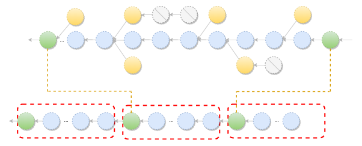
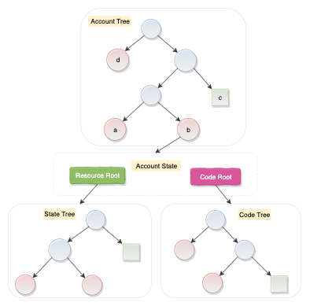
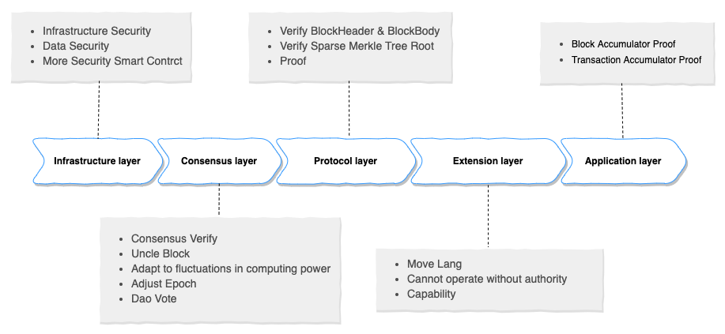
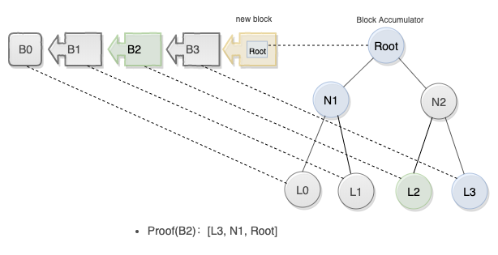

# Starcoin: A Hierarchical Smart Contract Based Decentralized Finance Network


Abstract: Starcoin is a decentralized hierarchical smart contract network. It aims to provide a secured digital asset and a decentralized financial operation platform, so that the blockchain can be applied in more fields with a lower threshold. We have proposed a hierarchical blockchain model to create a goal that can guarantee the security of digital assets and achieve high performance and scalability. Security is the foundation of the blockchain. Starcoin has taken security as the primary goal from the beginning of its design. To ensure the security of digital assets, It has conducted in-depth exploration and improvement from multiple levels such as the base layer, consensus layer, protocol layer, extension layer, and application layer.

In order to achieve the goal of decentralization, we base Starcoin on the foundation of the mature Satoshi Nakamoto consensus algorithm. We have made significant enhancements which makes Starcoin adaptive to the computing power of the network so as to achieve the balance between on-chain performance and stability. The transactions in Starcoin are processed on top of smart contracts, with the support of Move - a programming language exclusively designed for Starcoin. We use Move programming language to define the core mechanisms of the blockchain, such as digital assets and DAO governance rules. These core mechanisms can create a unique decentralized governance mechanism.

In order to verify the overall design of Starcoin, we have built an open source prototype implementation.


## Introduction

Starcoin is a new generation of public blockchain infrastructure, a hierarchical, decentralized blockchain system.


Layer I of Starcoin focuses on providing the basic capabilities for producing, managing, and trading digital assets, with which users can define assets safely and quickly and flexibly perform asset transfer and exchange with the help of smart contracts.

Layer II of Starcoin focuses on addressing the scalability and performance issues during the transfer and exchange process of the digital assets. Due to the unique design of Starcoin, the Starcoin Layer II  can use the data of Layer I, and Layer I can also verify the calculation results of Layer II. Both Layer I and Layer II are organically combined, and the digital assets can circulate freely between the two layers.

The impossible trinity of blockchain has long been an existing problem of blockchain-based systems. The impossible trinity of blockchain refers to the fact that a blockchain system cannot be strongly scalable, fully decentralized, and perfectly secure at the same time. Usually, only two of them can be achieved simultaneously. 

Bitcoin and Ethereum are typical examples of pursuing "decentralization" and "security" without caring much about "scalability". Other blockchain-based systems also make trade-offs between these three aspects. However, meeting only two of these aspects is far from enough for meeting the needs of commercial use.

With the hierarchical blockchain technology, Starcoin attempts to meet the needs of commercial use by achieving full-scale decentralization and security on its Layer I and achieving strong scalability on Layer II, so as to meet the needs of commercial use. Starcoin tries to break the curse of the impossible trinity by utilizing the two tightly coupled blockchain layers.


### Design Philosophy

1. A value circulation-centric focus -- all the layering strategies and the improvements of peripheral functions are for the purpose of promoting the value circulation.
2. Hierarchical consensus governance -- not all cognition requires global consensus, and consensus needs to be layered. The lower layer  should focus more on security and decentralization, the upper layer should focus more on performance and convenience.
3. Making possibilities with technology, Making choices via community -- Divergence needs to be eliminated as much as possible by utilizing technology instead of human intervention. We should promote the creation of possibilities and technological neutrality. The choices regarding values should be reserved for the community to determine. 


Now we introduce the design of Starcoin from 6 aspects:

## 1. Enhanced Consensus Protocol based on Nakamoto’s Protocol


The Starcoin consensus is an enhanced version of the Satoshi Nakamoto consensus protocol adopted by Bitcoin. In order to speed up block generation and reduce transaction confirmation time, we use runtime data such as uncle block rate to dynamically adjust block generation time, difficulty, and block rewards, which can maximize the use of the network and reduce user waiting time. In addition, we also provide the dynamic adjustment capability of the blockchain, and some key parameters can be modified through the on-chain governance mechanism.

The Satoshi Nakamoto consensus mechanism was first applied in  Bitcoin, and it was also a consensus method widely used in the early days of blockchain[1]. So far, the Satoshi Nakamoto consensus is the most fault-tolerant public chain consensus mechanism. It features a concise design and low communication overhead. It has been verified by decades of practice. However, the drawback is its low throughput and its time-consuming block generation process which hurt the user experience. Therefore, we strengthened the Satoshi Nakamoto consensus protocol, and now our Starcoin has the following characteristics:

1. The block generation speed and the block size can be dynamically adjusted so that the system can maintain a balance among security, network throughput, and user experience. 
2. The consensus-related parameters can be governed by the community and upgraded through contracts.


### The Application of Uncle Blocks

In the Nakamoto Consensus, to increase the network throughput, one can (1) increase the block size, or (2) shorten the block interval. Both of these methods will increase the probability of getting competing blocks in the network. Among these competing blocks, at most only one block can enter the main chain and contribute to the throughput boost as well as packaged transactions,  while other blocks become orphan blocks. A large block size can lead to shortened block generation time and more orphan blocks, which can, as a result, lower the difficulty of double- spending attack. Therefore,  we need to limit the orphan block rate within a threshold.


To this end, we introduce the concept of uncle block on the basis of orphan blocks. First, we define an epoch as every N blocks. A block B2 is defined to be the uncle block of another block B1 if the following conditions are satisfied:

1. Both B1 and B2 are generated in the same epoch.
2. The parent block of B2 belongs to any ancestor of B1.

We use the uncle block rate (i.e. uncle rate) in every epoch to evaluate the congestion of the network, and adjust the block generation time and block size according to the uncle block rate. to make full use of the network and increase throughput while avoiding over-large blocks or block generation time. Too short leads to too many orphan blocks and reduces safety.



### Dynamic Block Generation Time Adjustment

To keep the number of uncle blocks within an appropriate range, we adjust the block generation time of the next epoch.

If the uncle rate is high, there must be more forks and orphan blocks in the network under the current block generation time interval. We need to increase the block generation time to alleviate this problem. On the contrary, it shows that the block generation of the whole network is good, and the block generation time can be further shortened, and the throughput of the whole network can be further improved.

Our algorithm involves the following parameters: 

| Name               | Description                    |
| ------------------ | ------------------------------ |
| epoch_avg_time     | The arithmetic mean of block generation time during the last cycle. |
| epoch_uncles_rate  | The uncle rate of the last cycle.       |
| uncles_rate_target | Target uncle rate                    |
| next_time_target   | The block generation time of the next cycle.         |


Equation:

```rust
next_time_target = epoch_avg_time * epoch_uncles_rate / uncles_rate_target
```

### Dynamic Adjustment on Block Size

We hope that the block size limit can be dynamically adjusted according to the network situation, and the block size is proportional to the gas used by all transactions in the block, so we adjust the block size by adjusting the block gas limit.

The dynamic block adjustment mechanism dynamically adjusts the gas limit of each block based on the targeting Gas value within an Epoch as well as the current block generation speed. When the block generation speed approaches its minimum value defined in the system settings, the congestion of the entire network is in good condition. Therefore, the gas limit of the block can be adjusted to increase the block size; conversely, when the block generation speed reaches the maximum value set by the system, the entire network is relatively congested, so it is necessary to reduce the gas limit of the block and reduce the block size.


### Dynamic Adjustment on Consensus Difficulty

Starcoin improved the difficulty adjustment algorithm of the Satoshi Nakamoto consensus, so as to:

1. Respond more quickly: When the computing power of the entire network changes, the difficulty value can react quickly.
2. Stabilize the block generation time: when the whole network's computing power remains unchanged, some blocks are sporadically generated quickly or slowly, and the difficulty should not fluctuate sharply.


We perform improvement through the following methods:

1. Adjusting the block generation time according to the uncle rate so as to adjust the difficulty of the next Epoch.
2. In the difficulty calculation, the block height is introduced as the weight, and the average block generation time is calculated as the arithmetic mean of height-weighted block generation time.
3. Using a shorter difficulty period.


Our algorithm involves the following parameters: 

| Name                             | Description                    |
| ------------------ | ------------------------------ |
| block_time_target | The block generation time of the next epoch.           |
| n                 | The number of blocks in the difficulty adjustment cycle (less than the number of blocks in the Epoch, the initial value is one-tenth of the number of Epoch blocks) |
| next_target               | Difficulty target for the next cycle         |
| block_target_i         | The difficulty of the block with height `i`             |
| block_time_i            | The block generation time of the block with height `i`   |


Equation:

```rust
next_target = avg_target * avg_time / block_time_target
```

where:

```rust
Arithmetic Mean avg_target
avg_target = (block_target_cur-n+1 + block_target_cur-n +...+ block_target_cur) / n

Weighted Arithmetic Mean avg_time
avg_time = block_time_cur-n+1 * 1 + block_time_cur-n * 2 +...+ block_time_cur * n / ((n) * (n+1) / 2)
```

### Dynamic Adjustment on the Block Generation Reward

The dynamic adjustment algorithm of Starcoin is based on the uncle rate data. The uncle block information requires additional costs for the miners to collect. In order to encourage the miners to report the uncle block information in the block, a certain reward will be allocated to the miner who currently reports the uncle block information.

The adjustment of Starcoin block rewards follows the following principles:

1. The reward is linear in difficulty/time. According to the block generation time of the next cycle, the block reward is dynamically adjusted.
2. A certain percentage of rewards is allocated to the block reporting the uncle block.

We calculate the uncle block reward using the following equation:


```rust
reward = next_epoch_block_reward * (1 + reward_per_uncle_percent * uncles)
next_epoch_reward_block = base_reward_per_block * block_next_time_target / base_time_target
```

## 2. State Storage with Clear Ownership Definition

The state storage mechanism is one of the key points in the design of a blockchain system, which has a great impact on both performance and security. With an account model similar to the one in Ethereum, in the state storage of Starcoin, we form a state tree through address mapping mechanism. Starting from the genesis state, we use the transaction information as the input to derive the next new state and hence generate a new state tree. 

Ethereum divides accounts into contract accounts and user accounts. The contract account is used to deploy the code of the contract and store the state of the contract. The state of the user in a certain contract is saved under the contract account, and the read and write permissions are also controlled by the contract itself. Such a design is highly flexible, but it leads to unclear ownership of the contract state, which is easy to cause security problems and it is difficult to solve the "state explosion" problem.

Based on the Starcoin Ethereum account model, the following improvements have been made:

1. The contract account is abandoned, smart contracts can be deployed in any account, and the deployed smart contract is under the current account.
2. By changing the state storage mechanism in the contract programming language, smart contract developers can easily store the state of the contract in the address of the user to which the state belongs, so as to clarify the ownership of the state.

Through such a transformation, on the one hand, the security protection capability of the chain for the user's states is enhanced, and on the other hand, it also provides the possibility for state billing.


### Two-level State Model

We adopted the Jellyfish-Merkle tree in our design and extended it with branching functionality, so as to encapsulate it into a two-level state tree structure serving as the basic component of state storage. Jellyfish-Merkle tree follows a prefix tree structure. The state of the entire chain is maintained by a global tree, and each leaf node corresponds to the state of each user - AccountState. The path from the root node to any child node corresponds to an account address. The root hash value of the secondary Merkle tree is stored in AccountState, which corresponds to the Resource and Code of the user, as shown in the figure below:



The leaf node of the Code tree is the code of each contract Module, and the query path is the Module name. The leaf node of the Resource tree is the state in the contract, and the query path is the state type StructTag. In this way, the contract can be read through the `borrow_global<T>(address)` method or write the state through `move_to(address,resource)` method.

Starcoin can easily provide status existence and equity proof through a two-level state model.

### Billing Strategy

Since the number of  states in the blockchain network will grow as the number of accounts increases, and the billing of the read-write access against the states is calculated through Gas in a single shot when a transaction occurs, users will not pay the extra cost of the long-term on-chain state occupation. Therefore, they are not motivated to clean up the stale, useless states. Therefore, the blockchain community has been exploring an appropriate state billing mechanism, and some people have proposed a state-leasing mechanism on the basis of Ethereum. However, due to the unclear ownership of the contract state on the Ethereum mentioned earlier, it is very difficult to implement the state billing mechanism. The Starcoin's state mechanism clearly defines the state ownership and hence provides the possibility of state billing.


The Starcoin’s state billing strategy adopts a post-calculation method. The storage space STCBytes that the user can use is converted in real time according to the STC held by the user. Before each transaction, the system checks the user's STCBytes balance (the equation is as follows), if the balance is less than the threshold, the execution of the transaction will be rejected.


Equation for calculating the balance:


```rust
STCBytes Balance = STC  *  Exchange Rate - STCBytes allocated to the user 
```

The STCBytes utilizes the storage state corresponding to the completion of the most recent transaction. The user is allowed to overuse it once, so that the current transaction does not need to be considered when calculating STCBytes. Such a mechanism can encourage users to proactively release unused resources and reduce the use of STCBytes, which is beneficial to the healthy development of the system.


## 3. A New Generation of Smart Contract Programming Languages, Virtual Machines and Standard Libraries

Smart contract programming languages, virtual machines, and contract standard libraries are the core components of decentralized financial infrastructure. A hot research direction in blockchain smart contracts is to explore how to safely and conveniently represent assets in smart contracts. Starcoin provides digital asset oriented smart programming languages, virtual machines, and abundant contract standard libraries.


### Move Programming Language

The Move programming language first appeared in Facebook's Diem blockchain project [5]. As a digital asset oriented smart contract programming language, Move prioritizes Resource as the first-class citizen and is flexible, secure, and verifiable. These characteristics are in line with the design philosophy of Starcoin's smart contract programming language. This is why Starcoin chose Move as its primary smart contract programming language.


**Resource as the First-class Citizen**

The native on-chain assets in Ethereum are ETHs, and the user-defined assets are  ERC20-compliant tokens. The contract follows entirely different rules for processing native assets and tokens. Also, the chain itself is only aware of ETHs instead of Tokens. The security levels of ETHs and Tokens are different. However, in Starcoin, both the native on-chain STCs and the user-defined Tokens are Resources and are first-class citizens in the chain. They are operated through the same programming interfaces and share the same security level. 

**Security**

Assets in Ethereum are represented by integers [2]. Assets are actually stored in a mapping table which maps the user address to his balance of the contract account, which is used to record the amount of assets owned by each user. The contract needs to implement each interface carefully to ensure that assets will not be copied or lost. Also, Move is different from Solidity in that it can define Resource types with linear logic semantics. Developers can use Resource to customize assets. Resource can never be copied or implicitly discarded, and can only be moved between different storage locations in a program. Such security guarantee is rooted in Move's static type system. With Resource, the developers can not only create secure digital assets, but also easily write correct business logic to operate the assets.

There are usually two options to ensure resource safety, type safety, and memory safety. One is  to use a high-level programming language and to let the compiler verify the safety. The other is to use  a low-level typeless assembly process and to perform runtime safety verification. Move takes a neutralized approach where the typed bytecode is adopted. A safety check similar to the bytecode check in JVM will be performed before the bytecode gets executed.  The advantage of this approach is that there is no need to check the credibility of the source code compiler.

In addition, Move's Module is a strongly typed abstraction mechanism. Types and methods can be declared in Modules. These methods can be used to create, destroy, and update the types declared in Modules. A type is transparent in the Module where the type is defined. It is non-transparent, however, to the outside of its declaring Module. Namely, the data types declared in the Module cannot be directly created, updated, and destroyed from the outside of the Module. It must be created, updated, and destroyed through the methods declared in the Module.

**Verifiability**

Ideally, all security features can be guaranteed through the runtime on-chain bytecode verification, but this will increase the computational overhead and the protocol complexity on the chain. The static verification tools (including formal verification tools) can effectively reduce the on-chain computational overhead and improve the security. Move defines a specification language suite called Move specification language, which describes what is a valid execution of the program via a series of preconditions, postconditions, invariants, etc., which is the so-called specification. The Move programs and specification will be transformed into a boogie program (an intermediate verification language with formal semantic definitions) by a Move-boogie compiler. Finally, we use an automated theorem proving solver in the field of formal verification to verify whether the program conforms to the specification.

**Flexibility**

In Move programming language, the transactions are composed of Module and Script. Module allows developers to use and extend standard library functions to develop their smart contracts. Script allows users to use one or more Modules in transactions and to add more logics. This combination of Module and Script makes transactions more flexible and saves a lot of time and space.

### Move Virtual Machine

From an abstract point of view, the blockchain is actually a Replicated State Machine. The world state is updated by executing transactions on the virtual machine. The input of the Move virtual machine is a combination of the transaction bytecode and the world state, while the output is a set of changes that update the world state.

The Move virtual machine consists of two parts: a bytecode interpreter and a bytecode verifier. In order to express the semantics of Resource, the register-based virtual machine implementation will make it complicated to move the Resource among methods, while the stack-based virtual machine implementation coupled with typed local variables will make this operation very natural. Therefore, the interpreter of Move uses a stack-based bytecode interpreter which is similar to JVM. The same as EVM, Move also uses the Gas mechanism to solve the halting problem.

The safety of Move is mainly guaranteed by the bytecode verifier. Before the interpreter is executed, the validator must first check the security. The core functions of the validator include: control flow graph generation, out-of-bounds check against the stack, type and category check, reference check, and link to the world state, etc. The stack out-of-bounds check is to detect the access range of the operand stack for each method in order to ensure valid depth for all stack accesses. Specifically, on the basis of coding blocks, we review the impact of each bytecode execution against the operand stack. We then ensure that the type of operand is correct by a type verification process. Also, we ensure that Resource cannot be replicated and destroyed using class verification. Additionally, by reference verification, we ensure that Resource can be appropriately used even without any ownership. Finally, we link the Resource type in the bytecode with the world state.

### Standard Library

As a universal and secure smart contract platform, Starcoin provides the developers with a formally verified smart contract standard library. The standard library contains more than 40 commonly used function modules. In addition to the basic function modules such as accounts, transfers, transactions, events, Errors, Math, and Vector, etc., it also contains forward-looking function modules such as Token, Dao, and OnChainConfig.

**Token**

Ethereum defines Token through the ERC20 interface. As mentioned above, the Token of Ethereum is stored in a mapping table of the contract account, which is actually a central ledger. The contract needs to implement each ERC20 interface very carefully to ensure that assets will not be copied or lost. Starcoin does not use a central ledger, but instead uses Resource and Capability to implement a Token mechanism for decentralized management.

**DAO**

Decentralized governance played a vital role in the blockchain system which is a fast-developing and self-renewing collection of organizations. Starcoin abstracts a set of on-chain governance mechanisms, including proposals by proposers, voting by participants (voters), decision-making, deployment, and execution. These steps are respectively encapsulated in different smart contract standard modules, and contract developers can directly reuse the governance mechanism in the standard module.

**Formal Verification**

All Modules in the Starcoin standard library have undergone formal verification. Each method in the Module corresponds to a particular specification, which describes what is a valid execution of the program via a series of preconditions, postconditions, invariants, etc. The implementation of Module is guaranteed to be complied with the specification through the application of the formal verification tool - Move Prover. The formal verification process greatly improves the security and reliability of the standard library.

## 4. Self-evolving Decentralized On-chain Governance System

The governance structure of the blockchain includes the processes of decision-making and communication, which has an implicit but long-term impact on the blockchain and, specifically, its public chain ecosystem. Off-chain governance comes from the last generation of public chains, while on-chain governance is more popular in the new generation of public chains. The token governance of the contract agreement has also pushed the wave of decentralized finance on Ethereum to an unprecedented peak, which is also an important issue that the next generation of public chains should seriously consider. In the long run, on-chain governance conforms to the open connotation of blockchain, and Starcoin has also made its own unique improvements with on-chain governance and contract governance.

### Governance in a Nutshell

If the blockchain community is recognized as an organization, the governance can be considered as the decision-making process that the organization performs for changing the  blockchain features. Particularly, for consensus and economic distribution, it is essentially the "constitution" of the blockchain. In terms of process, governance includes several contents such as proposers’ proposal, participants’ votes, decision-making, deployment, and execution. The role of governance is to guide the development of  the blockchain system into a long-lasting and orderly process and hence boost the value of the entire network. Traditional organizations are generally limited to one country, the governance mechanism follows the rules that agree with local laws, and disputes arising from governance can be adjudicated by the judicial system. As for decentralized blockchain governance, its participants come from all over the world and cannot rely on judicial system rulings. The approaches to abstract a set of reasonable governance mechanisms for solving disputes and building constraints still remain to be explored.


Governance models such as Bitcoin's BIP and Ethereum's EIP are basically off-chain governance models. The general process runs through proposal submission, community discussion, development and version release by core developers, miners’ upgrade, and finally automated new feature activation pre-defined somewhere in the code. In most of the cases, this governance model works well, but once developers and miners in the community have irreconcilable divergence over a certain feature, the chain and the community will have to face the risk of a hard fork.

Looking at the major diverging moments of both Bitcoin and Ethereum, it can be found that community governance are facing two major dilemmas:

1. There is no clear indicator to determine which proposition has reached a majority consensus in the community.
2. The agreement negotiated off-chain does not have constraining power on the chain.


Therefore, we try to implement on-chain governance in Starcoin and try to solve the above two dilemmas to a certain extent.


### The Governance of Starcoin

We believe that on-chain governance can, to some extent, address the two dilemmas mentioned above. First of all, regardless of the design of the governance mechanism, voting will eventually produce a clear result and convey a clear message to the community. Secondly, on-chain governance defers the time for decision-making. Developers and miners can perform their professional responsibilities first, focus on evaluating the feasibility of the proposal purely from a technical point of view, and then develop and upgrade the node. When all works are done, they can decide with community members whether to activate and when to activate the new features. Finally, once the results of the on-chain voting are generated, since the nodes have actually been upgraded, the final voting results will be automatically executed on the chain and hence will have the constraining power.


So we propose the design principle of the governance mechanism: "The technique creates the possibilities, and the community makes the decisions”. In the development and upgrade phases, developers and miners should maintain a technologically neutral attitude towards the proposal, and when the upgrade is completed and the voting is required, they will work with community members to make the final decisions.

The on-chain governance of Starcoin has the following processes:

1. The proposer initiates a proposal. There is no admission restriction for initiating a proposal. All participants in the system can initiate a proposal.
2. After publicity, voters vote. The current voting mechanism is Token pledge voting, and the number of votes is proportional to the number of pledged Tokens.
3. After the voting period, any system participant can call the decision-making contract to make proposal decisions.
4. The proposal can be executed by any participant in the system if it passes the decision and is publicized again.


Starcoin's on-chain governance mechanism has several important design considerations:

**Governability of the Governance System**

The design of each on-chain governance system needs to consider:

1. Admission principles for proposers and voters.
2. The voting participation rate and the voting pass rate in the decision-making process.
3. Choice of voting system.


These factors determine the degree of decentralization of the governance system and the efficiency of decision execution. However, due to the complexity of governance, it is impossible to design a perfect governance system from scratch, so an evolution mechanism for the governance system is very important. Participants of the Starcoin system can use the on-chain governance strategy to upgrade the governance parameters of the system and to perform decentralized governance upgrade using the voting system. Therefore, the governance system can continuously evolve so as to adapt to the ever-changing and constantly updated blockchain technology boom.

**Reusability of the Governance System**

Many decentralized financial protocols are built upon the token governance system, and the protocol is constantly iterated through the governance of the protocol token. Starcoin's governance system natively supports any token protocol. To achieve token governance, one only needs to link the token protocol to Starcoin's governance contract, thereby reusing the entire governance system. Contract governance is built into Starcoin's contract standard library, which enables decentralized financial protocols to make better use of token governance to achieve the continuous upgrade and development of the protocol.

**Minimal Entry Threshold**

There is no entry threshold for various roles in the governance process, including the proposer, voter, or executor. This ensures the minimal entry limit and fully utilizes the wisdom of the community.

**Summary**

The success of the blockchain depends on its ability to evolve. This evolution will bring about many directional decisions, and the governance about these decisions plays a decisive role in determining the future of the system. Different from other blockchain systems with governance capabilities, Starcoin unifies the governance of the chain itself and the governance of the contract agreement, so that the governance mechanism of Starcoin can serve a broader range of decentralized applications. At the same time, through self-evolution, it continuously upgrades to a more mature governance system. 


## 5. Secured Blockchain


Starcoin takes "security" as one of its primary goals since day one of its design. We performed in-depth thinking from multiple perspectives including the infrastructure layer, the consensus layer, the protocol layer, the extension layer, and the application layer. Moreover, we carried out our design with in-depth insight from multiple dimensions including data logic, smart contracts, and operation permission. Last but not the least, we strive for comprehensive coverage and make every effort to ensure the security of the chain and digital assets.



### Infrastructure Layer Security

Starcoin is developed by Rust language to ensure its memory safety and the efficiency of its basic components. As we all know, the use of C/C++ language often leads to memory safety issues, while other high-level languages ​​such as Java/Go/Python, etc., usually suffers from an inferiority of execution efficiency due to their runtime environment and the corresponding garbage collection mechanism. The Rust language combines the merits of these two types of language together. While ensuring memory safety, it also takes into account the ultimate execution efficiency. When choosing a development language, we fully considered factors such as safety and operational efficiency. The choice of using Rust ensures the safety and efficiency of Starcoin to the maximum extent.

In the overall design of Starcoin, we provide four data verification mechanisms:

1. The Verifiable Transactions: the BlockHeader contains the root hash of a global transaction accumulator, and any transaction on the chain has a corresponding global proof.
2. The Verifiable States: the BlockHeader contains a root hash of the global state tree to ensure that the state can be verified.
3. The Verifiable Blocks: the BlockHeader contains a hash of BlockBody, which is used to verify the data in BlockBody.
4. The Verifiable Chain: the BlockHeader contains the root hash of a global block accumulator. Any block can provide a proof of the relationship with the current block. It is not necessary to traverse the block to verify whether a block is the ancestor of the current block (as shown in the picture below). 



The above is the cornerstone of Starcoin’s security. Among them, the "transaction accumulator" and the "block accumulator" constitute Starcoin's unique "dual accumulator" model, which provides a solid foundation for data security.


### Consensus Layer Security

The Starcoin consensus has made some improvements to the Satoshi Nakamoto consensus. While inheriting the characteristics of the Satoshi Nakamoto consensus including security, complete decentralization and tamper resistance, the security improvements Starcoin has made are as follows:

1. More sensitive awareness and adaptiveness to the fluctuations of computing power.
2. On-chain governance-enabled adjustments on the consensus parameters for reducing the security risks caused by hard forks.


### Protocol Layer Security

The Starcoin protocol is designed on the basis of data security and consensus layer security, which fully guarantees the security of the chain in an untrusted network. Based on the principle of data verifiability, the Starcoin protocol performs strict verification on the received network data, and quickly identifies malicious nodes, thereby protecting the security of the nodes.

### Extension Layer Security

In order to better expand the capabilities of the blockchain, Starcoin takes the security of smart contracts as an important design goal. Starcoin uses the Move language as the smart contract language. The design principle of the Move language is to make the programming of digital assets safer and simpler, so safety and reliability are the first thing to be considered in the language design process. The designers of the Move language have fully learned lessons from past smart contract security incidents, and minimized the risk of accidental vulnerabilities or security incidents in the Move contract. Its security is mainly guaranteed by the following aspects:

1. Bottom-up static type system;
2. Resources cannot be copied or implicitly discarded;
3. Resources are stored by user, and the data operation permissions of the chain, contract, and user are redefined;
4. Introducing the formal verification technology to prove the security of the contract through mathematical principles.


### Application Layer Security

Starcoin mainly supports the security of the application layer in terms of the following aspects:

1. The multi-signature transactions are provided to facilitate the management of digital assets through multi-signature.
2. The private key reset function is provided so that the private key can be changed without changing the address of the account.
3. The application layer can easily determine whether the transaction is on the chain, verify whether the states and the blocks are valid through the aforementioned data verification mechanism, thereby ensuring the safety and reliability of the application.


## 6.  Hierarchical Network

**Background**

There are two major thoughts on addressing the scalability problem of the current blockchain, one is the layer-I scaling, and the other is the layer-II scaling. The layer-I scaling is limited by the impossible trinity, hence it is difficult to balance the security and scalability. As such, in the design of Starcoin, the layer-I mainly focuses on the security, the layer-II focus on the scalability. Both layer-I and layer-II jointly solve the scalability issue of the blockchain system. Such a thought is already a consensus reached by the public chain field after encountering difficulties in the layer-I scaling, such as the development route of Ethereum's Rollup [4] and Nervos' CKB [7].

The functions of layer-I in the hierarchical network:

1. Through the enhanced Satoshi Nakamoto consensus mechanism, we can scale up the capacity of layer-I on the basis of ensuring security as much as possible, and maximize the utilization of the layer-I network (the dynamic adjustment mechanism of block generation time and block size, see the consensus section).
2. We provide the definition, issuance, and circulation of the assets,  as well as the ability to transfer between layer-I and layer-II.
3. We provide arbitration capabilities on layer-II, so that layer-II can utilize the security mechanism of layer-I to ensure its own security.


The functions of layer-II in the hierarchical network:

1. The transactions of layer-I are diverted to layer-II, and layer-I cares about neither the details of the transactions of layer-II nor the state changes. 
2. We provide a set of supervision mechanisms, the different roles of layer-II can supervise each other.
3. We provide evidence preservation capabilities. If users have disputes about transactions on layer-II, they can go to layer-I for arbitration.


### Overview of the Layer II Solution

**State Channel**

The general state channel includes a payment channel, but the state of the latter can only be an asset, while the general state channel tries to extend the state to any state of the application. The basic idea of ​​the state channel is to supervise the two parties of the channel, so that the previous state changes of both parties can be migrated from the chain to somewhere off the chain, and the on-chain liquidation can be performed when the channel is closed (it can also be optimized as a scheduled liquidation), which is equivalent to combining multiple transactions into one, thereby reducing transaction costs and increasing overall transaction capacity. The cost of state changes in the channel is extremely low, so it can support high-frequency transactions or Internet applications where both parties interact frequently (such as games). Although in theory the participants of the state channel can be multiple parties, since any change on the state channel needs to be confirmed by all participants, it is difficult to extend to more than two participants, which limits its application scenarios.

**Side Chain**

The industry does not have an accurate definition of side chain or sub chain, and many people do not think that side chain is a layer-II solution. But we define a condition here. When the consensus mechanism of the side chain relies on the consensus mechanism of layer-I and  an arbitration mechanism is provided to allow users or node operators of the side chain to challenge the state reached by the side chain consensus on layer-I, and when the consensus state of the side chain can be overturned by a layer-I arbitration mechanism, we think that this side chain solution is a layer-II solution, otherwise the side chain is an independent chain, which is essentially the same as cross chains connected among multiple chains. The advantage of the side chain as a layer-II solution is that it can be extended to any number of parties, and the side chain has a one-layer arbitration constraint, so that as long as one single side chain node is an honest node, the network security can be guaranteed.

**RollupChain**

RollupChain is an emerging layer-II solution in the blockchain community, which essentially can be considered as an improvement on the original Commit-Chain solution (such as Plasma). In the Commit-Chain solution, the operator of layer-II chain needs to submit the state root or block header proof of the layer-II chain to layer-I, and the user can directly withdraw from the layer-II assets at layer-I through the proof of their own state. If the party provided a wrong proof, the user can also challenge the proof submitted by the operator to ensure the security of layer-II. However, in Plasma's solution, data availability has always been a problem. Users do not have the full data. The operator of the layer-II chain may prevent users from constructing proofs that challenge themselves by hiding data or denial of service. The key improvement of RollupChain is to directly submit the data of layer-II to the block of layer-I. The block of layer-I only "records" the transaction data of layer-II, but does not execute it. When users need to challenge the operator, they can always find data on layer-I and construct the proof, thus solving the problem of data availability. Although RollupChain is limited by the capacity of layer-I (because its transactions also need to occupy the capacity of a layer of blocks), it simplifies the complexity of the challenge mechanism in the design of Plasma and other solutions, and is currently easier to implement.

**Verifiable Off-chain Calculations**

Verifiable off-chain calculations include solutions such as zk-rollup. The idea is the same as the mechanism of RollupChain. However, it introduces zero-knowledge proofs, which avoids the difficulty that the layer-II transaction needs to be challenged and still needs to be executed at layer-I. layer-I only needs to provide the ability to verify the zero-knowledge proof.

**Unified Layer-II Model**

Summarizing the current layer-II solutions, it can be found that there is no "silver bullet" that can address the scalability problem of the blockchain in a single shot. The solution to the scalability problem of the blockchain requires continuous evolution in practice. But at the same time, various layer-II solutions essentially share common characteristics, so we can abstract a general layer-II model to adapt to the continuous evolution of the layer-II solution. Currently, there are several key questions regarding layer-II networks:

1. How to safely transfer the state of the application (including assets) between layer-I and layer-II.
2. How to ensure the data availability of layer-II.
3. How to prove and provide an arbitration mechanism.


The answers to these key questions are related to the storage mechanism of the layer-II transactions and states. A layer-II solution is essentially about locking the layer-I states and rebuilding it on layer-II. The changes of these states can be represented by a state tree.  Depending on the settings of the proof and challenge mechanism, we only need to submit the root of the layer-II state tree to layer-I either periodically or at the end, so that it can become a tree node in the external sub-tree of the layer-I state tree. We can use the same mechanism for layer-II state transition and proof as what is used in layer-I. In the layer-I design of Starcoin, it is easier to implement such a unified model, which mainly embodied in the following aspects:

1. All contract states are abstracted into a unified resource model to facilitate the state migration between layer-I and layer-II.
2. With the stateless design of the contract, the contract itself does not need to maintain any state. The state is provided by the underlying state storage model, which facilitates the migration of the contract between layer-I and layer-II.
3. The transaction accumulator  and the state storage model can provide a better state certification mechanism, which can be reused by both layer-I and layer-II.


The specific solution for the layer-II design of Starcoin will be explained in detail in the Starcoin’s layer-II white paper, which is to be released in the future. Here, we only explained the consideration about layer-II in the design of layer-I. 

## Conclusion

In summary, through the improvements in the consensus mechanism, the state storage, and the smart contract programming language, Starcoin, on the one hand, has enhanced security, making it more suitable for current decentralized financial application scenarios, and on the other hand, it has laid a foundation for layered architecture, in which different layers make different choices, so as to support the needs of high-performance DApp operations in the future. At the same time, the on-chain governance mechanism ensures the capabilities of continuous evolution and ecological construction of the chain.


**References**


1. S. Nakamoto, “Bitcoin: A Peer-to-Peer Electronic Cash System,” https://bitcoin.org/bitcoin.pdf, 2008. 
2. V. Buterin, "Ethereum A Next-Generation Smart Contract and Decentralized Application Platform", 2014.
3. Z. Amsden et al., “The Libra Blockchain.” https://developers.libra.org/docs/the-libra-blockchainpaper.
4. V. Buterin, “A rollup-centric ethereum roadmap" https://ethereum-magicians.org/t/a-rollup-centric-ethereum-roadmap/4698.
5. S. Blackshear et al., “Move: A language with programmable resources,” https://developers.diem.com/docs/technical-papers/move-paper .
6. EOS IO. Eos.io technical white paper. https://github.com/EOSIO/Documentation, 2017.
7. “Nervos CKB: A Common Knowledge Base for Crypto-Economy” https://github.com/nervosnetwork/rfcs/blob/master/rfcs/0002-ckb/0002-ckb.md.
