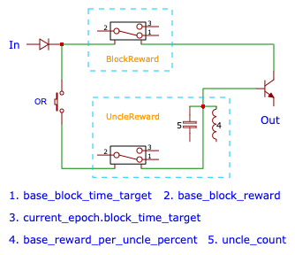
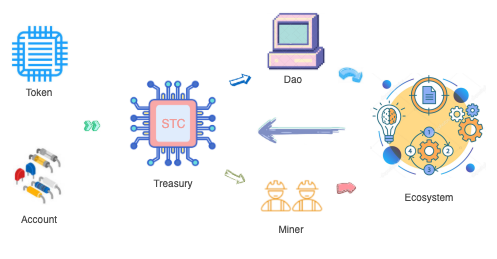

# Starcoin 经济白皮书

STC 是 Starcoin 网络的原生 Token，发行总量为 3,185,136,000 STC，总量恒定。

它的当前的主要用途有：

1. 支付交易的 gas 费用。
2. 支付状态空间费用（未来状态计费机制激活以后）。
3. 用于链上治理投票。

未来，随着链上生态的成熟，STC 将会有越来越多的使用场景。

## Token 创世分发

在 Starcoin 上，所有的 Token 都是链上一等公民，所以 STC 也符合 Starcoin 的 Token 规范。每一种 Token 创建后，发行账号会得到铸币权，拥有铸币权的账号可以铸造该 Token。

STC 的发行账号是 0x1 这个创世账号，该账号只用在创世交易以及区块的 meta 交易执行（类似于 Bitcoin 的 coinbase 交易）。创世交易中，创世账号会一次性将所有的 STC 铸造出来，并存到国库中，然后销毁铸币权，保证 STC 不能增发。

然后执行以下操作：

* 将 159,256,800  STC （5%）提取出来，转给 Starcoin 基金会账号（0xA550C18），用于分配给早期投资人。
* 发行一个总额度为 255,129,390  STC （8%），释放周期为 3 年的线性提款权，归属 Starcoin 基金会，用于生态建设。
* 发行一个总额度为 222,641,010  STC （7%），释放周期为 3 年的线性提款权，归属 Starcoin 基金会，用于核心项目开发。
* 将国库的提款权锁定到 DAO 中，以后从国库提款只能通过链上治理进行。 

注：线性提款权只是一种凭据，转让的时候并没有发生 Token 的转移。拥有者可以定期从国库将提款权中已经线性释放的部分提取出来。

## 区块奖励

Starcoin 中的区块奖励遵循按时间线性释放的模式，每个区块的奖励通过以下公式计算：

```
block_reward = base_block_reward/base_block_time_target * current_epoch.block_time_target
```

初始化时， base_block_reward 为 10 STC，base_block_time_target 为 10 秒钟，也就是说 1 秒释放一个 STC。如果当前 Epoch 的目标出块时间是 15 秒，当前 Epoch 每个区块的奖励就是 15 STC。

其中  base_block_reward 和 base_block_time_target 是链上配置，可通过链上治理调整。每个 Epoch 的出块目标时间（block_time_target）会根据前一个 Epoch 的叔块率动态调整（具体调整方式请参看技术白皮书）。

为了鼓励矿工汇报网络中的叔块，Starcoin 会给每个包含了叔块头的矿工额外的奖励（注：并不奖励挖出叔块的矿工）。

```
uncle_reward = block_reward * base_reward_per_uncle_percent * uncle_count
```

其中 base_reward_per_uncle_percent 为链上配置，初始化为 10%，可通过链上治理调整。uncle_count 是当前区块中包含的叔块头，最多 2 个。也就是说，如果某个区块中包含了 2 个叔块，可额外获得 20% 的奖励。



每个区块的奖励由创世账号从国库中提取出来，发送给出块的矿工，延迟 N 个块到帐，初始值是 7 个块。如果国库中余额为 0 ，则该区块没有区块奖励。

## 链上治理

Starcoin 内置了一套 DAO 合约，创世交易中，创世账号会初始化一个 DAO，并将 STC 设置为治理 Token。STC 的持有者可以参与以下治理项的治理：

1. 链上配置变更，比如上面的区块奖励参数。
2. DAO 相关参数的变更。
3. Stdlib 中的系统合约升级。
4. 从国库中申请提款权。

投票方式为 1 个 STC 1 票，当同意的票数大于反对的票数，并且超过 DAO 的最低票数阈值，则该提案通过。最低票数阈值由 STC 的真实流通量乘 DAO 的阈值比例得出，初始化的阈值比例是 4%。初始化的投票周期为 7 天，投票周期内参与投票的 STC 会锁定到提案中，直到投票结束。

注：STC 真实流通量 = STC 铸币总量 - 国库中的余额。也就是说，如果线性提款权未被使用，不会算在真实流通中。

## 国库提款权

国库提款权是一种矿工奖励之外的 STC 分发机制，如果有生态项目建设方，可发起提案，申请提款权。以下是发起流程：

1. 任何人都可以发起提案。提案中需指定线性提款权的接收方，需要的总数，线性释放的周期。
2. 社区成员通过 STC 投票支持或者反对该提案。
3. 提案通过后，接收方需要在链上执行提案，获取到线性提款权。
4. 接收方通过线性提款权定期从国库中提款。

## 经济模型自举



当前的 PoW 公链，PoW 既是保证安全的一种共识机制，也是 Token 的分发策略。PoW 链的经济模型中，Token 先分发给矿工，然后再流转到其他生态。

但这种模型对于 BTC 这样的以价值存储为目标的链来说，是可以形成生态闭环的，但对于智能合约链来说，Token 的价值依赖于链上的生态的繁荣，所以 Token 分发策略中应该向上层的生态应用倾斜，同时需要通过生态建设分发 Token，而不单纯通过矿工分发。

从长远来看，链上的基础生态收益，最后归入到国库中，国库资金如果最后可以覆盖未来的研发投入以及矿工奖励，说明链的经济模型实现了自举。