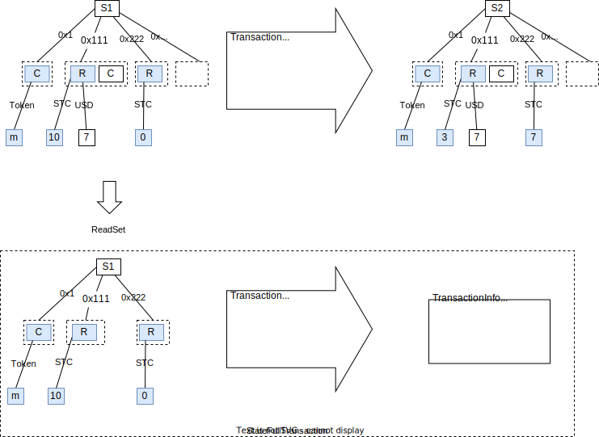
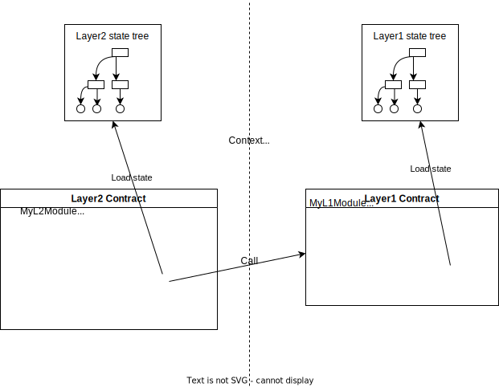
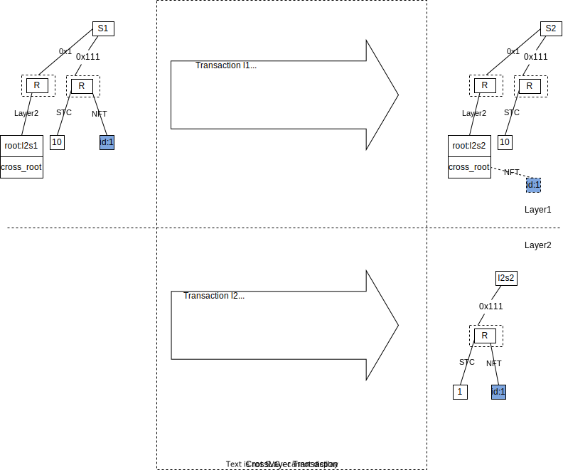
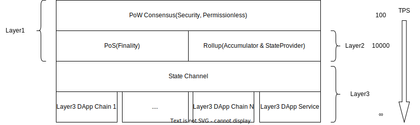

## Preface

Currently, the prototypes of various applications on top of blockchain are already available. However, a question that all public chains need to answer remains: How to make blockchain technology adopted on a large scale?

This question can be broken down into two questions:

1. How does the blockchain support massive users? That is, the blockchain's scaling problem.
2. In what way should applications be combined with the chain? That is, the relationship between the chain and Web3 applications.

Regarding the issue of scaling, there are three main approaches in the current blockchain world.

1. Scaling by improving the consensus mechanism, or by reducing the number of validation nodes, etc.
2. Scaling through sharding or parallel chains.
3. Scaling through layering.
 

Starcoin has chosen the third approach for the following reasons:

1. Layering is a customary approach to solve the scaling problem in human societies. For example, judicial systems and political institutions, all solve the scaling problem by layering. The constraint mechanism between different layers can ensure security.
2. In the impossible triangle of blockchain, Layer1 should focus more on security.
3. The requirements for decentralization, security, and throughput differs for different applications and different stages of applications. It is easier to achieve a gradual application-oriented evolutionary solution through a layered approach.

Stargate is a layered protocol framework on the Starcoin blockchain network. It supports different layering solutions through a universal abstraction. 

1. Layer1 ensures Security and Permissionless.
2. Layer2 enables Finality, migrating state and computation from Layer1 to Layer2, enabling global scaling and instant confirmation of transactions.
3. Layer3 supports Web3 applications through application-oriented consensus solutions.

<!--more-->

## Key Solutions

There are three main technical challenges in all the layering solutions:

1. How to verify and arbitrate the transaction execution results of Layer2 at Layer1 (and that of Layer3 at Layer2)?
2. Can Layer2 and Layer3 depend on Layer1's smart contracts? This affects the interlayer composability of smart contracts.
3. How does the state of a smart contract move between layers?

### Transaction verification

The execution of a transaction on the blockchain, while to be executed based on the historical state, will not actually read the entire historical state. A new state can also be calculated if only the state that the transaction depends on is provided.

The blockchain state transition can be represented by the following formula (from Ethereum Yellow Paper).

σt+1 ≡ Υ(σt, T)

- σ𝑡+1 represents the next world state
- Υ represents the state transition function
- σ𝑡 represents the current state of the world
- T represents a transaction

Y relies on the current state σ𝑡 to execute T, but Y does not read all σ𝑡 states. If a subset of the states required by Y, denoted by σ`𝑡, is extracted, and the proof that  σ`𝑡 σ𝑡 is also provided, the state transition can also be achieved.



We call
- the subset of states on which the execution of the transaction depends as ReadSet
- the proof of the states as ReadSetProof
- the package of ReadSet, ReadSetProof, the transaction, and the root hash of the state tree after execution as StateFullTransaction.

The data structure is represented as follows:

```rust
pub struct ReadSet {
  state:Vec<(AccessPath,Vec<u8>)>,
}
pub struct ReadSetProof {
  // TODO define proof
}

pub struct StateFullTransaction {
  read_set: ReadSet,
  proof: ReadSetProof,
  transaction: SignedUserTransaction,
  // Transaction info is transaction execute result, include new state_root, event_root, etc.
  transaction_info: TransactionInfo,
}
```

The StateFullTransaction contains the state that transaction execution depends on and is self-verifiable. The pseudo-code of the verification method is as follows.

```rust
StateLessVM {
  
  fn eval(txn: StateFullTransaction, prev_state_root: HashValue): bool {
    // Constructing a state tree via ReadSet
    let state_tree = build_state_tree(txn.read_set);
    assert(state_tree.root == prev_state_root);
    let output = execute_txn(&state_tree, txn.transaction);
    state_tree.apply(output.write_set);
    assert(state_tree.root == txn.transaction_info.state_root);
    // assert other field in transaction_info
  }
}
```


### Dependency of Smart Contracts

The layering of the blockchain brings a challenge of dependency relationship between smart contracts: Can Layer2 contracts depend on Layer1 contracts? The dependency here is twofold: The code dependency and the state dependency. In all current layered solutions, the problem of cross-layer contract dependency has not been well solved, and can only be interoperated through the mechanism of asynchronous messages.

In Stargate, Layer2 can depend on Layer1's contract directly at compile time due to the static dependency feature of Move. When a Layer2's contract executes, the execution context switches as shown in the following figure:



1. If the Layer1 contract on which the Layer2 contract depends is stateless and does not need to read state (e.g., a purely algorithmic contract), the dependency is the same as between Layer1 contracts.
2. If the Layer1 contract on which the Layer2 contract depends acquires a read-only state (using the borrow_global directive), the state is acquired from Layer1 via a remote state loader. However, the state read is not the latest state of Layer1, but rather a historical state of Layer1 associated with the Layer2 transaction.
3. If the Layer1 contract on which the Layer2 contract depends acquires a modifiable state (using the borrow_global_mut/move_from/move_to directive), then the transaction is a cross-layer transaction and a cross-layer state move transaction needs to be executed at Layer1. Whether this part can be made completely transparent to developers requires further technical research. Currently, the state move is performed explicitly.

This will provide a seamless cross-layer programming experience.

### State Movement

State movement between different Layers is similar to cross-chain solutions. Most current solutions lock Token or assets in one layer through contracts and then mint them in another layer, which requires designing verification and minting solutions for each state or asset type (for example, the verification of Token and NFT is different), or only implementing cross-chain contract calls to ensure successful transaction execution without verifying the state (which has security risks).

When using a resource-oriented programming language like Move, where state moves between different Layers similarly to how state is loaded from external storage in a contract, we can design a generic state movement model that supports cross-layer movements of free state.

1. Define a cross-layer transaction type that actually contains two transactions, one to be executed in Layer1 and another to be executed in Layer2.
2. In the Layer1 transaction, the state S is moved out of Layer1 via a call to the cross-layer contract and locked in a special data structure called SpacetimeBox, which exists in both the Layer1 and Layer2 states.
3. In Layer2's transaction, the SpacetimeBox is moved out and destroyed by calling the cross-layer contract to get S. Layer2 reports the status of S to Layer1.
4. When Layer2 reports the StateRoot to Layer1, it also submits the non-existence proof of the SpacetimeBox, which proves that the SpacetimeBox has been properly processed in Layer2, and Layer1 releases the SpacetimeBox.
5. The steps are similar when to move S from Layer2 back to Layer1, but in reverse order. The movement from Layer2 to Layer1 has different challenging periods for different scenarios, and the intermediate state is locked in the SpacetimeBox during the challenging period.



The example code as follow:

```rust
module CrossLayer {
   // Move state `s` to layer2 with the `id`, only can call on layer1 
   public native move_to_layer2<S>(signer: &signer, id: Layer2ID, s: S)；
   // Move state `S` from layer2 with the `id`, only can call on layer1 
   public native move_from_layer2<S>(signer: &signer, id: Layer2ID): S;
   // Move state `s` to layer1, only can call on layer2
   public native move_to_layer1<S>(signer: &signer, s: S);
   // Move state `S` from layer1, only can call on layer2
   public native move_from_layer1<S>(signer: &signer):S;
}

// transaction on layer1
public(script) script_on_layer1(signer: Signer) {
  let s = MyModule::get_state_from_somewhere(&signer);
  CrossLayer::move_to_layer2(&siger, dappx_layer2, s);
}

// transaction on dappx layer2
public(script) script_on_layer2(signer: Signer) {
  let s = CrossLayer::move_from_layer1<S>(&siger);
  // do something with s.
  LocalModule::save_to_layer2(&signer,s);
}
```

The encapsulation and verification of SpacetimeBox are implemented in the native layer and are transparent to the contract layer. The biggest challenge of generic state movement is the verification of the state, which can be divided into two types:

1. Mergeable stats, such as Token. For example, 1000 A Tokens and 100 A Tokens can be merged into 1100 Tokens. Each mergeable state needs to accumulate a total number in Layer1 and be verified when migrating across layers to ensure that Layer2 cannot create Token out of thin air.
2. Non-mergeable states, such as NFT, or user-contracted free states. Layer1 generates a state tree for all original state moved from Layer1, and records the root hash of the tree to ensure that the state is not changed when it is moved across layers. Non-mergeable state, when moved from Layer1 to Layer2, can only change the ownership and cannot be updated in Layer2.

## Technical Architecture



The overall architecture consists of three layers,

1. Layer1 ensures Security and Permissionless through PoW consensus. This part has been implemented.
2. Layer2 provides finality to Layer1 through PoS consensus and decentralization to Rollup's Accumulator. The Rollup solution can increase the overall TPS of the network by a factor of 10 to 100.
3. Layer3 isolates the consensus of different applications in the application network through State Channel and DAppChain, which enables unlimited scalability.

### Rollup

Rollup is a scaling solution and there are several roles in Rollup:

1. Accumulator, also known as Sequencer or Aggregator in other projects. Stargate's Rollup solution, not only provides sorting but also accumulates transaction hashes, which are used to provide proof of the order of transactions. The accumulator also executes transactions and periodically commits the root hash of the state tree to Layer1 after each transaction is executed.
2. The State Provider executes the transactions according to the transaction order provided by the accumulator and provides the state query API to users.
3. Verifier, executes transactions and compares them with the root hash of the state tree submitted to Layer1 by the accumulator, and submits proof of fraud to Layer1 if the accumulator is found to be cheating.

The current Stargate rollup solution is a type of Optimistic Rollup, where Layer1 does not verify every transaction in Layer2, but optimistically trusts Layer2's Accumulator node until a verifier presents proof of fraud, which is equivalent to migrating both computation and state to Layer2.

Considering that the ZK Rollup scheme will be introduced in the future, Stargate's architecture is designed as an abstract solution for the verification mechanism of transactions, which can be implemented by verifying FullStatusTransactions or by verifying zero-knowledge proofs, and the different solutions can be adopted through a universal architecture.

Stargate's Rollup solution differs from other Rollup solutions in several ways.

1. The accumulator and Layer1 share a PoS consensus network, achieving decentralization and high availability.
2. The accumulator provides the sequential proofs and the verification mechanism for StateFullTransaction, allowing the wallet client to verify the transactions and take on the verifier role.
3. Data availability is guaranteed by the Layer2 PoS consensus network and the wallet client, and the accumulator can submit hashes of Layer2 transactions to Layer1 only, allowing Rollup to increase throughput by 100x.

Rollup still relies on the global consensus of Layer1, so it is limited by the throughput capacity of Layer1. Its main goal is to reduce the computational cost of Layer1, maintain state off-chain, and ensure security through an optimistic challenge mechanism. It can instantly confirm the transaction status of Layer2, providing users with an Internet-like application experience, and also laying the foundation for the Layer3 solutions.

### State Channel

State Channel, or Payment Channel, represented by Lightning Network, is also a proven scaling solution. The idea is that each participant pledges a certain amount of assets on the chain, and then maintains a local consensus state off-chain for both participants (theoretically, it can be extended to multiple participants), and each transaction requires confirmation from both participants. However, to solve the problem of non-cooperation, either party can be forced to initiate a liquidation transaction on the chain, and after waiting for a challenging period, the channel will be automatically closed and the participants will be liquidated based on the last confirmed state by both participants.

The State Channel solution in Stargate differs from other state channels in several ways:

1. SmartContract can be executed in the State Channel so that the channel can be used not only to transfer Token but also to execute complex, stateful contracts.
2. As it can execute contracts, it can also pay any type of Assert, as well as NFTs.
3. State Channel are built on Layer2 instead of Layer1, mainly because they rely on Layer2's instant confirmation capability to reduce the cost and confirmation time to create the channel.

One of the key thresholds for the massive adoption of State Channel is that the cost of creating a channel on Layer1 is high and the waiting time is long.

However, if the State Channel is on Layer2, this threshold can be eliminated. This allows any two nodes in the Starcoin/Stargate P2P network to upgrade their P2P connections to a State Channel, and then perform data transfer and streaming billing over the State Channel. This is also the infrastructure of DAppService.

### DAppService

Built on the Stargate framework, it provides a paid RPC service through State Channel network.

DAppService is not decentralized, but it runs on a P2P network, allowing service discovery and remote call through the P2P network, and billing through the State Channel.

It is equivalent to a bridge from Web2 service to Web3 service, and any current Web2 service can change its payment method to a streaming billing method and enter into Web3 P2P network directly.

### DAppChain

The DApp Chain is built based on the Stargete framework and includes a sub-consensus mechanism, which requires registration in Layer2 and collateralizing a certain amount of Layer2 assets. A user who encountered a fraudulent DApp can submit proof of fraud to Layer2, and Layer2 will punish the DApp, but the penalty is limited to the maximum amount of the DApp's registered collateral assets.

The overview of network architecture is shown in the following figure:


1. Layer1 is in the same P2P network as Layer2, Layer3, and the user's endpoint wallet, all of which can communicate through the P2P network.
2. The endpoints are fully exploited. The endpoint wallets have their own identity in the P2P network, can execute and verify transactions, can store transaction history, provide data availability, and can submit Layer2's fraud proofs to Layer1. Similarly, they can submit DApp's fraud proofs to Layer2.
3. Different DApps, such as X DApp, Y DApp, can choose different options to access the Starcoin network.

Finally, to answer the two questions in the opening paragraph.

1. How does a blockchain support massive users? Starcoin achieves scaling through a layered solution. Moreover, if a chain wants to support massive DApp users, it is difficult to achieve the goal by Rollup solution alone, so local consensus mechanism must be considered. Therefore, Stargate provides the integrated Layer1 + Layer2 (Rollup) + Layer3 (DAppService + DAppChain) solution.
2. In what way should applications be combined with the chain? In the future, applications will be combined with chains in two approaches: One is to use the chain as a payment channel, and Stargate provides DAppService that can connect traditional WebService directly to the Web3 infrastructure. The other is application chains, where Stargate provides an application chain framework to quickly build application chains and integrate them into the Starcoin network, securely governed by Layer2 and Layer1, and where assets can be moved between different layers and DApps.


## Roadmap


Roadmap contains three main areas:

1. Layer1, Layer2, Layer3: Solve the chain scalability problem and provide integration solutions for DApps.
2. Move and DApp ecosystem: Lower the barrier of entry for developers and provide full-stack tools to them.
3. Interoperability of multi-chain ecosystem: To interoperate with other chains and integrate into the ecosystem of other chains as much as possible.

Here, the arrows indicate dependencies and dashed lines indicate possible exploration areas.

The Starcoin team tried to explore the Layer2 solution on Bitcoin and Ethereum during the first year and came to two basic conclusions:

1. Bitcoin's Script limitations make it difficult for Layer1 to provide arbitration ability for Layer2 transactions, and the arbitration logic must be converted to lock mode (hash lock, time lock) through a complex protocol, making it difficult to support the requirements of DApp-oriented Layer2.
2. Ethereum's smart contracts are powerful, but because its contract state is bound in the contract account, it cannot do cross-layer state movement and type reuse. On the one hand, it is difficult to achieve universal state movement, and on the other hand, it is difficult to support the composability of smart contracts across layers, and the bottleneck will be unavoidable when the relationship between applications is more complicated in feature.

Therefore, the Starcoin team adopted a new smart contract language, Move, and first conducted PoC tests on the Stargate technology idea by simulating Layer1, trying to execute smart contracts in the State Channel, and then decided to make a new Layer1 for Layer2 public chain, introducing Move smart contracts in Layer1.

In May 2021, the Starcoin main network was launched. After half year of stable operation and continuous iteration, by now (January 2022) Layer1 has the initial key dependencies of Layer2, so the design and development of the Stargate project will continue.

The Stargate roadmap has the following key milestones:

1. EasyGas, which implements the ability to pay for Gas with any Token. This feature relies on swap on the chain and will be implemented around Q1 2022.
2. Light nodes, do not keep all states, but can execute transactions, verify blocks, and generate rich state transactions. Embedded light nodes (browser or mobile clients) rely on the implementation of light nodes, and rich-state client wallets rely on the implementation of embedded light nodes.
3. Layered hybrid consensus mechanism, adding a PoS consensus mechanism on top of PoW, providing finality to Layer1.
4. In the first phase of Rollup, the high availability of the Accumulator is not considered. The focus is the verification of FullStateTransactions, movement of state between different layers, and cross-layer contract dependencies.
5. In the second phase of Rollup, Rollup and PoS consensus are integrated to solve the problems of Accumulator high availability and decentralization.
6. RPC framework on top of the P2P network. it is a generic P2P web service framework to simplify the development of RPC services on P2P networks.
7. Rollup-based state channel, and DAppService framework on top of state channel.
8. Rollup-based DAppChain framework.


### Glossary of Terms

1. Free state: In Move, if an instance of a type can be held by other Modules, the state is regarded as free.
