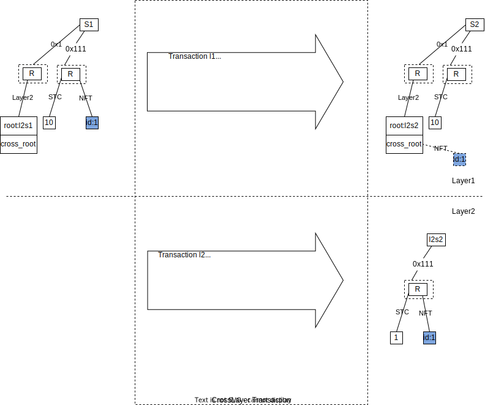
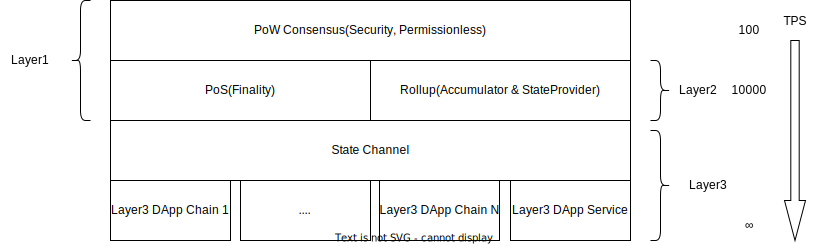

## 前言

当前，区块链之上的各种应用的雏形已经具备，但如何让区块链技术大规模采用，是所有的公链需要解答的问题。

这个问题可以拆解为两个问题：

1. 区块链如何接受大规模用户？也就是区块链的扩容难题。
2. 应用应该以什么形态和链结合？也就是链和 Web3 应用的关系。

关于扩容的问题，当前区块链世界主要有三条路线：

1. 通过改进共识机制，或者减少验证节点等方式来实现扩容。
2. 通过分片或者平行链来实现扩容。
3. 通过分层的方式进行扩容。

Starcoin 选择了第三种路线，主要是基于以下理由：

1. 分层是一种人类社会习惯的解决扩容问题的方式，比如司法系统，政治机构，都是通过分层来解决扩容难题，不同层之间的制约机制可以保证安全。
2. 区块链的不可能三角中，Layer1 应该更侧重安全。
3. 不同的应用，应用的不同阶段，对去中心化的要求，对安全的要求，对吞吐的要求都不一样，需要有一种面向应用的演进方案，通过分层的方式更容易实现。

Stargate 是 Starcoin 区块链网络上的分层协议框架。它通过统一的抽象，支持不同的分层方案。Layer1 保证安全（Security）和无准入（Permissionless）。Layer2 实现终局性（Finality），将状态和计算从 Layer1 迁移到 Layer2，实现全局扩容以及交易的即时确认。Layer3 通过面向应用的局部共识，最终实现对 Web3 应用的支撑。

<!--more-->


## 关键方案

分层的所有方案中，主要面临三个技术难题：

1. 如何在 Layer1 校验 Layer2 的执行结果并进行仲裁？Layer3 到 Layer2 同理。
2. Layer2 以及 Layer3 能否依赖 Layer1 的合约? 这个影响智能合约跨层的可组合性。
3. 合约的状态如何在不同的层之间迁移？

### 交易校验

区块链上执行一个交易，虽然要基于历史状态进行，但实际上不会读取全部的历史状态。如果只提供该交易所依赖的状态，也可以计算出新的状态。

区块链的状态转换可以通过以下公式表达（以太坊黄皮书）：

σt+1 ≡ Υ(σt, T)

- σ𝑡+1 代表下一个世界状态
- Υ 代表状态转换函数
- σ𝑡 代表当前世界状态
- T 代表一个交易

Y 要执行 T 的时候，依赖当前状态 σ𝑡，但 Y 并不会读取所有的历史状态，如果把 Y 需要的状态抽出一个子集 σ`𝑡，并同时提供证明，σ`𝑡 属于 σ𝑡，就可以实现状态转换。


我们把交易执行所依赖的前置状态子集叫做读取集（ReadSet），状态的证明叫读取集证明（ReadSetProof)，把它们和交易以及执行后的状态树的根哈希一起打包，叫做富状态交易（StateFullTransaction）。

数据结构表达如下：

```rust
pub struct ReadSet {
  state:Vec<(AccessPath,Vec<u8>)>,
}
pub struct ReadSetProof {
  //TODO define proof
}

pub struct StateFullTransaction {
  read_set: ReadSet,
  proof: ReadSetProof,
  transaction: SignedUserTransaction,
  // Transaction info is transaction execute result, include new state_root, event_root, etc.
  transaction_info: TransactionInfo,
}

```

富状态交易包含了交易执行依赖的状态，是可以自校验的，校验方法的伪代码表达如下：

```rust
StateLessVM {
  
  fn eval(txn: StateFullTransaction, prev_state_root: HashValue): bool {
    // 通过 ReadSet 构造状态树
    let state_tree = build_state_tree(txn.read_set);
    // 验证 state_tree 的 root 和 prev_state_root 一致 
    assert(state_tree.root == prev_state_root);
    // 在状态树的基础上执行交易
    let output = execute_txn(&state_tree, txn.transaction);
    // 将执行结果中的 WriteSet 写入 state_tree
    state_tree.apply(output.write_set);
    // 验证执行后的结果和 StateFullTransaction 的 transaction info 匹配
    assert(state_tree.root == txn.transaction_info.state_root);
    // 验证 transaction_info 中的其他字段
  }
}
```


### 智能合约的依赖

区块链分层后，给智能合约之间的依赖关系带来了难题，Layer2 的合约能否依赖 Layer 1 的合约？这里的依赖包含两方面的意义，一代码的依赖，二状态的依赖。当前的所有分层方案中，跨层的合约依赖问题都没有得到很好的解决，只能通过异步消息的机制互通。

在 Stargate 中，基于 Move 的静态依赖的特性，Layer2 可以在编译期直接依赖 Layer1 的合约。当 Layer2 的合约执行时，执行上下文的切换如下图所示：


1. 如果 Layer2 合约依赖的 Layer1 的合约是无状态的，不需要读取状态（比如纯算法的合约），则和 Layer1 合约和 Layer1 合约之间的依赖一样。
2. 如果 Layer2 合约依赖的 Layer1 的合约获取了只读状态(使用 borrow_global 指令)，则通过远程状态加载器从 Layer1 获取状态。不过读取的状态不是 Layer1 的最新状态，而是该 Layer2 交易关联的 Layer1 高度的历史状态。
3. 如果 Layer2 合约依赖的 Layer1 的合约获取了可修改状态(使用 borrow_global_mut/move_from/move_to 指令)，则表明这个交易是一个跨层的交易，需要到 Layer1 执行跨层的状态迁移交易。这部分是否可以做成对开发者完全透明，需要进一步技术调研。当前先通过一种显式的方式进行状态迁移。

这样，就可以提供一种近乎于无缝的跨层的编程体验。

### 状态迁移

状态在不同的 Layer 之间迁移，类似于跨链方案，当前大多数方案都是通过合约将 Token 或者资产在某一层锁定，然后在另外一层铸造出来，需要针对每一种状态或者资产类型设计校验以及铸造方案（比如 Token 和 NFT 的校验是不一样的），或者只实现跨链的合约调用，确保交易执行成功，并不校验状态（有安全风险）。

使用 Move 这种面向资源的编程语言时，状态在不同的 Layer 之间迁移和合约中从外部存储加载状态类似，我们可以设计一种通用的状态迁移模型，支持任意的自由状态的跨层迁移。

1. 定义一种跨层的交易类型，该类型的交易实际上包含两个交易，一个需要在 Layer1 执行，一个需要在 Layer2 执行。
2. Layer1 的交易中，通过调用跨层的合约，将状态 S 从 Layer1 移动出来，锁定在一个特殊的数据结构中，叫做 SpacetimeBox， 这个结构同时存在与 Layer1 和 Layer2 的状态中。
3. Layer2 的交易中，通过调用跨层的合约，将 SpacetimeBox 移动出来并销毁，得到 S。
4. Layer2 给 Layer1 汇报 StateRoot 时，同时提交 SpacetimeBox 的不存在状态证明，证明 SpacetimeBox 已经在 Layer2 得到正确处理，Layer1 释放 SpacetimeBox。
5. 如果想从 Layer2 将 S 迁移回 Layer 1， 方法同理，不过顺序相反。从 Layer2 到 Layer1 的迁移，不同的方案有不同的挑战期，挑战期间中间状态会锁在 SpacetimeBox 中。



示例代码如下：

```rust
module CrossLayer {
   // Move state `s` to layer2 with the `id`, only can call on layer1 
   public native move_to_layer2<S>(signer: &signer, id: Layer2ID, s: S)；
   // Move state `S` from layer2 with the `id`, only can call on layer1 
   public native move_from_layer2<S>(signer: &signer, id: Layer2ID): S;
   // Move state `s` to layer1, only can call on layer2
   public native move_to_layer1<S>(signer: &signer, s: S);
   // Move state `S` from layer1, only can call on layer2
   public native move_from_layer1<S>(signer: &signer):S;
}

// transaction on layer1
public(script) script_on_layer1(signer: Signer){
  let s = MyModule::get_state_from_somewhere(&signer);
  CrossLayer::move_to_layer2(&siger, dappx_layer2, s);
}

// transaction on dappx layer2
public(script) script_on_layer2(signer: Signer){
  let s = CrossLayer::move_from_layer1<S>(&siger);
  // do something with s.
  LocalModule::save_to_layer2(&signer,s);
}
```

SpacetimeBox 的封装以及校验是在 native 层实现的，对合约层是透明的。通用的状态迁移最大的难题在于状态的校验，我们可以把状态分为两种：

1. 可以合并的状态，例如 Token。比如 1000 个 A Token 和 100 个 A Token 可以合并为 1100 个 Token。每种可以合并的状态需要在 Layer1 累加一个总数，跨层迁移时进行校验，保证二层不能凭空创造出 Token。
2. 不可合并的状态，例如 NFT，或者用户合约自定义的自由状态。SpacetimeBox 中记录了原始状态的哈希，保证状态跨层迁移时状态不会被改变。不可合并的状态，从 Layer1 迁移到 Layer2，只能改变归属，不能在 Layer2 更新。 

## 技术架构



整体架构分为三层，

1. Layer1  通过 PoW 共识保证安全（Security）和无准入（Permissionless）。这部分已经实现。
2. Layer2 通过 PoS 共识给 Layer1 提供终局性（Finality），同时给 Rollup 的 Accumulator 提供去中心化能力。 Rollup 方案可以让网络整体的 TPS 提高到 10～100 倍。
3. Layer3 通过状态通道（State Channel）以及 DAppChain ，将不同的应用的共识隔离在应用的局部网络中，可提供无限的扩展能力。

### Rollup

Rollup 是一种相对成熟的扩容机制，一些项目已经实现，在 Rollup 中有几个角色：

1. 累加器（Accumulator），在其他项目中叫定序器（Sequencer）或者聚合器（Aggregator）。它主要的功能是给交易排序，并且定期将 Layer2 的交易提交到 Layer1 。Stargate 的 Rollup 方案中，它不仅仅提供排序，同时会将交易哈希进行累加，用于提供交易的顺序证明。累加器同时也要执行交易，并且定时将每个交易执行之后的状态树的根哈希提交到 Layer1。
2. 状态提供者（State Provider），按照累加器提供的交易顺序，执行交易，给第三方提供状态查询接口。
3. 校验者（Verifier），执行交易并与累加器提交到 Layer1  的状态树的根哈希进行比较，如果发现累加器作弊则向 Layer1 提交欺诈证明。

当前 Stargate 的 Rollup 方案属于 Optimistic Rollup 的一种。Optimistic Rollup 方案下，Layer1 并不会校验 Layer2 的每个交易，而是乐观的相信 Layer2 的 Accumulator 节点，直到有校验者提出欺诈证明，这样相当于把计算和状态都迁移到了 Layer2。

考虑到未来可能引入 ZK Rollup 方案，Stargate 的架构上，交易的校验机制设计为一种抽象的方案，可以通过富状态交易的重复执行的方式实现，也可以通过零知识证明的方式实现，可以通过统一的架构适配不同的方案。

Stargate 的 Rollup 方案相对于其他的 Rollup 方案有几个差异点：

1. 累加器和 Layer1 共享一套 PoS 共识网络，实现去中心化以及高可用。
2. 通过累加器提供的顺序证明，以及富状态交易的验证机制，让钱包客户端也具有验证交易的能力，从而承担校验者的能力。
3. 数据可用性由 Layer2 PoS 共识网络以及钱包客户端来保证，累加器可以只给 Layer1 提交 Layer2 交易的哈希，这样 Rollup 可以将吞吐提升 100x。

Rollup 依然依赖 Layer1 的全局共识，所以受限于 Layer1 的吞吐能力。它的主要目标是降低 Layer1 的计算成本，将状态维护在链下，通过乐观（Optimistic）挑战机制保证安全，可以即时确认 Layer2 的交易状态，给用户提供类似互联网应用的体验，同时也为 Layer3 的扩展方案打好基础。

### State Channel

状态通道（State Channel） ，或者叫支付通道（Payment Channel），以闪电网络（Lightning Network ）为代表，也是一种比较成熟的扩容方案。它的思路是双方各自抵押一部分资产在链上，然后在链下维护一个两个参与方（理论上也可以扩展到多个参与方）的局部共识状态，每次变更都需要双方确认。但为了解决单方不合作难题，任何一方都可以单方在链上发起关闭通道的交易，等待一个挑战期后，通道自动关闭，参与方按最后一次双方确认的状态进行清算。

Stargate 中的 State Channel 方案和其他状态通道有几个差异点：

1. State Channel 中可以执行合约，这样通道不仅仅用来转账，还可以执行一些复杂的，有状态累计的合约。
2. 因为它可以执行合约，所以也可以支付任意类型的 Token，以及 NFT。
3. 状态通道构建在 Layer2 之上，而不是 Layer1 之上，主要是要依赖 Layer2 的即时确认能力，降低建立通道的成本以及确认时间。

状态通道要大规模的应用，其中一个关键门槛是，Layer1 上的状态通道创建成本比较高，等待确认时间比较长。

但如果状态通道在 Layer2 之上，则可以消除这个门槛。这样 Starcoin/Stargate P2P 网络中的任意两个节点，都可以将自己的 P2P 连接升级为状态通道，然后通过状态通道进行数据传输和流式计费。这也是 DAppService 的基础设施。

### DAppService

基于 Stargate 框架搭建的，通过状态通道网络提供付费的 RPC 服务。

DAppService 本身不是去中心化的，但它运行在 P2P 网络上，可以通过 P2P 网络进行服务发现以及远程调用，通过状态通道进行计费。

它相当于 Web2 服务到 Web3 服务的一个桥，任意当前的互联网服务都可以将自己的付费机制变更为流式计费机制，直接接入到 Web3 的 P2P 网络中。 

### DAppChain

基于 Stargete 框架搭建的，包含子共识机制的 DApp Chain。它需要注册到 Layer2 中，同时抵押一定数额的 Layer2 资产。如果用户遇到 DApp 的欺诈，可向 Layer2 提交欺诈证明，Layer2 会对 DApp 进行惩罚，但惩罚的上限以 DApp 的注册抵押资产为上限。

整体网络概览架构如下图：


1. Layer1 与 Layer2，Layer3 以及用户的终端钱包，都在同一个 P2P 网络中，都可以通过 P2P 网络进行通信。
2. 充分发挥终端的作用。终端钱包有自己在 P2P 网络中的身份，可以执行和验证交易，可以存储交易历史，提供数据可用性，可以提交 Layer2 的欺诈证明给 Layer1。同样，也可以提交 DApp 的欺诈证明给 Layer2。
3. 不同的 DApp，比如 X DApp, Y DApp 可选择不同的方案接入到 Starcoin 网络。

最后回答开篇提出的两个问题：

1. 区块链如何接受大规模用户？Starcoin 通过分层的方案来实现扩容。并且一个链要支持大规模的 DApp 接入，仅仅靠 Rollup 方案很难达到目的，必须考虑局部共识机制，所以 Stargate 提供了整体的 Layer1 + Layer2（Rollup） + Layer3（DAppService + DAppChain） 解决方案。
2. 应用应该以什么形态和链结合？未来应用会以两种方式和链结合，一种是只将链作为付费通道，Stargate 提供 DAppService 可以将传统的 WebService 直接接入到 Web3 的基础设施中。另外一种是 DApp 本身作为一个链，Stargate 提供一个应用链框架，可以快速搭建应用链，并接入到 Starcoin 网络中，安全受 Layer2 和 Layer1 的约束，资产可以在不同的层以及 DApp 之间迁移。

## 路线图


路线图包含了三个主要的方向：

1. Layer1 ， Layer2，Layer3，主要目标解决链的扩展性难题以及给 DApp 提供集成方案。
2. Move 以及 DApp 生态，主要目标是降低开发者的学习门槛以及给开发者提供全栈工具。
3. 多链生态的互操作性，主要目标是尽可能和其他链互通，融入到其他链的生态中去。

其中，箭头表示依赖关系，虚线表示可能的探索方向。

Starcoin 团队在团队成立最初的一年多时间里，尝试在 Bitcoin 以及 Ethereum 上试验 Layer2 的方案，并得出了两个基本的结论：

1. Bitcoin 由于 Script 的限制，Layer1 很难给 Layer2 的交易提供仲裁能力，必须通过复杂的协议，将仲裁逻辑转换成锁模式（哈希锁，时间锁），很难支撑面向 DApp 的 Layer2 的需求。
2. Ethereum 的智能合约功能强大，但由于它的合约状态都绑定在合约账户内，无法做到跨层的状态迁移以及类型复用。一方面很难实现通用的状态迁移，另外一方面跨层的智能合约之间很难发挥出组合能力，等应用之间的关系进一步复杂就会遇到瓶颈。

所以 Starcoin 团队尝试了一种新的智能合约语言 Move，并先通过模拟 Layer1 的方式来对 Stargate 技术思路进行 PoC 试验，尝试在状态通道中执行智能合约，然后决定做一条新的 Layer1 for Layer2 的公链，在 Layer1 引入 Move 智能合约。

2021 年 5月，Starcoin 主网上线。经过半年的稳定运行和持续迭代，到现在（2022 年 1月）Layer1 已经初步具备了 Layer2 的关键依赖，所以继续 Stargate 项目的设计与开发，有以下几个关键节点：

1. EasyGas，实现以任意 Token 支付 Gas 的能力。该特性依赖于链上的 swap。大约在 2022 年第一季度实现。
2. 轻节点，轻节点虽然不保存全局状态，但可以执行交易，校验区块，生成富状态交易。嵌入式轻节点（浏览器或者手机客户端）依赖轻节点的实现，富状态客户端钱包依赖嵌入式轻节点的实现。
3. 分层的混合共识机制，在 PoW 基础上新增一套 PoS 的共识机制，给 Layer1 提供终局性。
4. Rollup 第一阶段，不考虑 Accumulator 的高可用，主要实现富状态交易的验证，状态的在不同层之间的迁移，以及跨层的合约依赖。
5. Rollup 第二阶段，将 Rollup 和 PoS 共识整合在一起，解决 Accumulator 高可用和去中心化的问题。
6. P2P 网络之上的 RPC 框架，这个是一个通用的 P2P 网络服务框架，用来简化 P2P 网络上的 RPC 服务的开发。
7. 基于 Rollup 的状态通道，以及状态通道之上的 DAppService 框架。
8. 基于 Rollup 的 DAppChain 框架。  


### 术语说明

1. 自由状态：在 Move 中，如果某种类型的实例可以由外部 Module 持有，则认为该状态的自由的。

> 注：本文档还在持续更新完善中，并不是最终版本。
