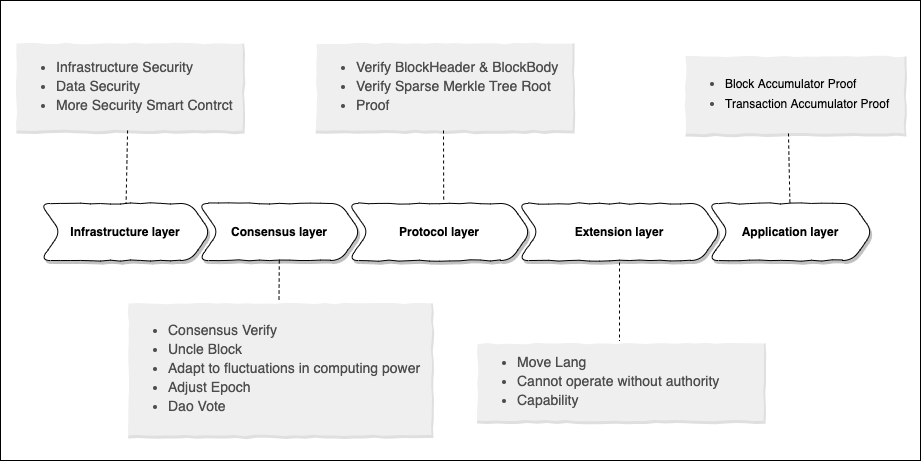
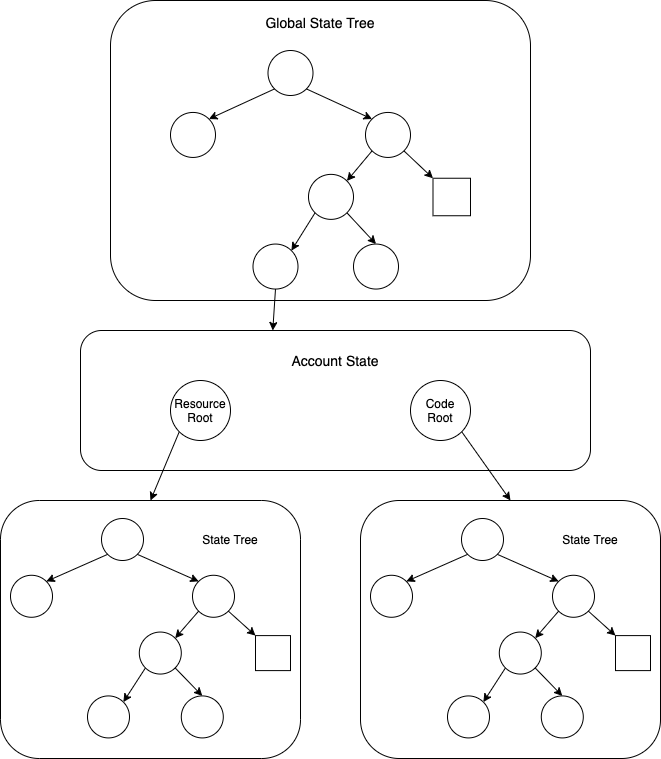

# Starcoin, 一个分层智能合约及去中心化金融网络


摘要：Starcoin 是一个去中心化分层智能合约网络，它旨在提供一种安全的数字资产及去中心化金融运行平台，让区块链能够更低门槛应用在更多领域。我们提出了一个分层区块链模型的建议，旨在创建一个数字资产安全、并能达到性能及可扩展的目标。安全是区块链立身之本，Starcoin 从设计之初就把安全作为首要目标，从基础层、共识层、协议层、扩展层、应用层等多层面进行深度探索与改进，全力保障主链和数字资产的安全。

为了达到去中心化的目的，Starcoin 选择成熟的中本聪共识算法，并在其基础上进行增强，可以动态适应网络算力状态，达到链上性能及稳定性的平衡。交易是基于智能合约来运行，使用一种名为 Move 的编程语言。我们使用 Move 来定义区块链的核心机制，如数字资产和 DAO 治理规则。这些核心机制能够创建一个独特的去中心化治理机制。

为了验证 Starcoin 整体设计，我们已经构建了一个开源的原型实现。

## 1. 简介

Starcoin 是新一代的区块链公链基础设施，是一个分层的，去中心化的区块链系统。

Starcoin 一层专注于提供数字资产基本能力，能够安全快速的定义资产，并通过智能合约灵活地实现资产转移交换等能力。

Starcoin 二层专注于解决资产转移交换等过程中的扩展性和性能问题。由于 Starcoin 的特殊设计，Starcoin 二层可以使用一层的数据，一层也可以校验二层的运算结果，一层二层有机结合在一起，资产可以在一二层之间自由流动。

长久以来，区块链系统存在所谓的区块链不可能三角，即无法同时达到可扩展（Scalability）、去中心化（Decentralization）、安全（Security），三者只能得其二。

比特币以及以太坊便是一种追求“去中心化”与“安全”的技术组合，而不追求可扩展。其他区块链项目也都是在这三者之间进行选择。而三者只选择其二的做法，很大程度上难以满足商业使用的需求。

Starcoin 试图通过区块链分层技术，在区块链一层达到去中心化和安全，通过区块链二层达到很大的可扩展性，达到可以供商业使用的程度。因此可以说 Starcoin 试图通过紧密结合的区块链一层二层来打破区块链不可能三角。


### 设计理念

1.	以价值流转为中心 —— 所有的分层以及周边功能的改进都是以促进价值流转为中心目标。 
2.	共识分层治理 —— 不是所有的认知都需要全局共识，共识也需要分层。越底层越侧重于安全和去中心化，越上层越侧重于性能和便利性。 
3.	技术创造可能，社区决定取舍 —— 尽量通过技术消弭分歧，创造可能，保持技术中立，价值观层面的的选择和取舍留给社区决定。

接下来从 6 个方面来介绍 Starcoin 的设计。

## 2. 安全的区块链


Starcoin 从设计之初就把「安全」作为首要目标之一，从基础层、共识层、协议层、扩展层、应用层等多层面进行深入思考，从数据逻辑、智能合约、操作权等多维度进行深度设计，力争全方位覆盖，全力保障链和数字资产的安全。



### 基础层安全

Starcoin 使用 Rust 语言开发，保障基础组件的内存安全与高效。众所周知，使用 C/C++ 语言经常有内存安全方面的问题，而其他一些高级语言如 Java/Go/Python 等，受 Runtime 和垃圾回收机制等方面的影响，执行效率通常会比 C/C++ 略逊一筹。Rust 语言集二者长处于一身，在保证了内存安全的同时，又兼顾了极致的执行效率。Starcoin 在选择开发语言的时候充分考虑到了安全性和运行效率等因素，选择 Rust 语言开发，最大程度上保障 Starcoin 的安全与高效。

在 Starcoin 的整体设计中，在四个层面进行数据校验：

1. 交易可校验：BlockHeader 包含一个全局交易累加器的根哈希，任何上链的交易都有对应的全局证明。
2. 状态可校验：BlockHeader 包含一个全局状态状态树的根哈希，保障了状态可验证。
3. 区块可校验：BlockHeader 包含一个 BlockBody 的哈希，区块哈希是 BlockHeader 的哈希，所以对于确定的区块哈希，BlockHeader 和 BlockBody 无法篡改。
4. 链可校验：BlockHeader 包含一个全局区块累加器的根哈希。任何一个区块可以提供一个和当前区块的关系证明，不需要遍历区块即可验证某个区块是否是当前区块的祖先区块。参考下图


以上是 Starcoin 安全性的基石。其中，「交易累加器」和「区块累积器」组成了 Starcoin 独特的「双累加器」模型，为数据安全提供坚实的基础。


### 共识层安全

Starcoin 共识针对中本聪共识做了一些改良，在继承中本聪共识安全、完全去中心化和防篡改等特性的同时，为了更好的提升安全和效率，Starcoin 共识有一些独特的设计：

1. 可配置的叔块奖励机制，减少分叉；
2. 更加敏锐的感知和适应算力波动；
3. 动态调整出块时间和难度，更加充分的利用网络带宽；
4. 在极端情况，可通过 DAO 投票调整链上的共识配置，降低安全风险；

### 协议层安全

Starcoin 协议在数据安全和共识层安全的基础上进行设计，充分保障了链在非可信网络中的安全性。Starcoin 协议本着数据可验证的原则，对接收到的网络数据进行严格的校验，迅速甄别作恶节点，从而起到保护节点安全的作用。

### 扩展层安全

为了更好地扩展区块链的能力，Starcoin 将智能合约的安全作为重要设计目标。Starcoin 使用 Move 语言作为智能合约语言。Move 语言的设计理念是让针对数字资产的编程更加安全、简单，所以在语言的设计过程中首先考虑了安全性和可靠性。Move 语言的设计者们从以往的智能合约安全事件中充分吸取经验教训，最大可能的降低 Move 合约出现意外漏洞或安全事件的风险，其安全性主要由以下几个方面保证：

1. 自底向上的静态类型系统；
2. 资源不可复制或者隐式丢弃；
3. 资源按用户存储，重新定义链，合约，用户三方的数据操作权限；
4. 引入形式化验证技术，通过数学原理来证明合约的安全性；

### 应用层安全

Starcoin 主要在以下层面支撑应用层的安全性：

1. 提供多签交易，方便通过多签来管理数字资产。
2. 提供私钥重置功能，在账号地址不变的情况下，可变更私钥。
3. 应用层可通过前面提到的数据校验机制，方便地确定交易是否上链、验证状态以及区块是否合法，从而保证应用的安全与可靠。


## 3. 新一代开发生态，智能合约编程语言、虚拟机和标准库

智能合约编程语言，虚拟机，以及合约标准库是去中心化金融基础设施的核心部分，如何安全、便捷的在智能合约中表达资产，是区块链智能合约领域一直在研究的方向。Starcoin 选择面向数字资产的智能编程语言，以及虚拟机，并提供了丰富的合约标准库。


### Move 编程语言

Move 编程语言最早出现在 Facebook 的 Libra 区块链项目中 [5]。作为一种面向数字资产的智能合约编程语言，Move 具有 Resource 作为一等公民、灵活、安全、可验证等特性。这些特性和 Starcoin 的智能合约编程语言设计理念极为契合，因此 Starcoin 选择 Move 做为其智能合约的首选编程语言。

** Resource 作为一等公民**

以太坊中的链上原生资产是 ETH，而用户定义的的资产是符合 ERC20 的 Token，合约中处理原生资产和 Token 需要使用完全不同的规则。同时链本身只对 ETH 有感知，对 Token 无感知，二者的安全级别有差异。而在 Starcoin 中，无论是链上原生的 STC，还是用户自定义的 Token，都是 Resource 类型，对链来说都是一等公民，使用同样的编程接口操作，安全级别一致。

**安全性**

以太坊里资产是用整型来表示 [2]。资产实际上存放在合约账户中一个用户地址到 uint256 的映射表里，它用来记录每个用户所拥有的资产数量。合约需要非常仔细的实现每个接口，以保证不会发生资产被复制或者丢失的情况。而 Move 不同于 Solidity ，它能够以线性逻辑的语义来定义 Resource 类型，开发者可以用 Resource 来自定义资产，Resource 永远不能复制或隐式丢弃，只能在程序存储位置之间移动。 这种安全保证根植于 Move 的静态类型系统，开发者不仅可以使用 Resource 来创建安全的数字资产，而且更容易编写正确的业务逻辑来操作资产。

保证资源安全、类型安全、内存安全通常有两个选择：使用高级编程语言，编译器检查保证；或者使用低级无类型汇编，运行时检查保证。Move 采用一个折衷方案：使用有类型的字节码，字节码在执行前进行安全校验，类似于 JVM 的字节码校验，然后再解释执行。这样做的好处是源码的编译器不用是可信的。

此外，Move 的 Module 是一种强类型抽象机制，Module 里面可以声明类型和方法，这些方法可以用来创建、销毁和更新 Module 里声明的类型。 在声明类型的 Module 内部，类型是透明的，而在其外部是不透明的。也就是说在 Module 外部无法直接创建、更新和销毁 Module 内声明的数据类型。必须通过 Module 里声明的方法来创建、更新和销毁。

**可验证性**

理想情况下可以通过链上的字节码运行时校验保证所有的安全属性，可是这样会增加链上计算开销和协议复杂度。静态验证工具包括形式化验证工具可以有效降低链上计算开销、提升安全性。Move 定义了一套规范语言叫做 Move specification language，它通过前提条件、后置条件、不变式等来描述程序怎么样才算正确运行，即所谓的规范。然后通过 Move to boogie compiler 将 Move 程序和规范转换成 boogie 程序——一种具有形式化语义的中间验证语言。最后通过形式验证领域的自动定理证明求解器来验证程序是否符合规范。

**灵活性**

Move 的交易由 Module 和 Script 组成。Module 允许开发人员使用和扩展标准库功能来开发其智能合约。Script 可以让用户在交易中使用一个或多个Module，加入更多逻辑。这种 Module 和 Script 相结合的形式使交易更加灵活，同时节省时间和资源。

### Move 虚拟机

从抽象的角度看，区块链实际上是一个复制状态机（Replicated State Machine）。世界状态通过在虚拟机上执行交易而更新。Move 虚拟机的输入就是交易的字节码加上当前的世界状态，输出是对世界状态进行更新的变更集。

Move 虚拟机由两部分组成：一个字节码解释器，一个字节码校验器。为了表达 Resource 的语义，基于寄存器的虚拟机实现会导致在方法间移动 Resource 变得复杂，而基于栈的虚拟机实现再加上有类型的局部变量会使这种操作变得自然。所以 Move 的解释器采用了类似于 JVM 的基于栈的字节码解释器。跟 EVM 类似，Move 也是采用 gas 机制来解决停机问题。

Move 的安全性主要是由字节码校验器来保证的。在解释器执行之前，先要由校验器对安全性进行检查。校验器的核心功能包括：控制流图的生成、栈的越界检查、类型和种类检查、引用检查，还有与世界状态的链接等。其中栈越界检查就是检测每个方法访问操作数栈的范围，保证访问的栈的深度是合法的。具体做法是以基础代码块为单位，查看每条字节码执行之后对操作数栈的影响。接下来是通过类型检查保证操作数的类型是正确的。通过种类检查保证 Resource 不可复制、不可销毁。通过引用检查保证即便没有所有权也可以通过借用机制正确使用某 Resource。最后将字节码里的 Resource 类型同世界状态进行链接。

### 标准库

作为一个通用、安全的智能合约平台，Starcoin 为开发者提供了经过形式化验证的智能合约标准库。标准库包含了40多个常用的功能模块，其中除了账户、转账、交易、事件、Errors、Math、Vector 等基本功能模块外，还包含了Token、Dao、OnChainConfig 等前瞻性功能模块。

**Token**

以太坊是通过 ERC20 接口来定义 Token 的。如上中提到的，以太坊的 Token 存放在合约账户中一个映射表里，实际上是一个中央账本，合约需要非常仔细的实现每个 ERC20 接口，以保证不会发生资产被复制或者丢失的情况。Starcoin 没有使用中央账本，而是利用 Resource 和 Capability 实现了去中心化管理的 Token 机制。

**DAO**

区块链作为一个快速发展、自我更新的组织集合，去中心化治理发挥了至关重要的作用。Starcoin 抽象出一套链上治理机制，包括提议者提议、参与者（投票者）投票、决策、部署、执行等几个步骤，分别封装在不同的智能合约标准模块中，合约开发者可以直接复用标准模块中的治理机制。

**形式化验证**

Starcoin 标准库里所有的 Module 都经过了形式化验证。Module 中的每个方法都建立了对应的规范，它通过前提条件、后置条件、不变式等来描述程序怎么样才算正确运行。然后通过 Move 的形式化验证工具 Move Prover 来保证 Module 的实现跟规范相符。形式化验证在很大程度上提升了标准库的安全性和可靠性。


## 4 灵活的去中心化链上治理体系

区块链的治理结构包含了决策和沟通的过程，对区块链特别是公链生态具有隐形但长远的作用。链下治理始于上一代公链，新一代的公链则更青睐链上治理。 合约协议的代币治理也将以太坊上去中心化金融浪潮推到了前所未有的高峰，这也是下一代公链应该考虑的严肃议题。 长远来看链上治理符合区块链的开放内涵，Starcoin 在链上治理以及合约治理方面也做出了自己独特的改进。

### 治理是什么

区块链是一个组织的集合，治理是这个组织就改变区块链特性所做出的决策过程，尤其针对于共识和经济分配，可以说是区块链的“宪法”。在流程上说，治理包含提议者提议、参与者（投票者）投票、决策、部署、执行等几个内容。 治理的作用在于使得区块链系统进入一个更加长久、有序的发展过程，提升整个网络的价值。 与中心化组织治理不同，去中心化的区块链治理，其参与者来自全球，而怎样从中抽象出一套合理治理机制，仍处于探索阶段。

**现有的治理方案**

从比特币诞生开始，所有的区块链都在摸索自己的治理模式，大体可分为链上治理和链下治理两种模式。 链下模式就是基于互联网的模式，比如比特币提案 BIP，以太坊提案 EIP 等，社区非常熟悉这种模式。 但是这些功能也可以搬到链上， 于是链上治理和链下治理似乎都形成了可行的模式，且都存在一些利弊。链上模式，是部分区块链自发的模式，也面临着很多挑战。下面我们分析部分公链的治理模式，来看一下区块链治理在链上治理和链下治理之间是如何此消彼长。

**链下治理**

比特币的治理模型相对简单，主要是链下治理推进，由核心开发者 Bitcoin core 进行协议的升级。 大部分参与者并不去关心如何治理，反而更关注分叉对币价的影响。比特币的链下治理在大部分情况下是非常顺畅的，几个重要的 BIP 也是通过链下完成，如分层确定性钱包协议等。

以太坊的治理主要通过 EIP 进行。由于 Vitalik 和 Ethereum Foundation 的存在，链下治理相对集中。目前所谓的链上治理，也只是尽可能地把链下的部分功能搬到链上，链下的个人影响力其实是无法消除，区块链发起人的声音几乎不可能被忽视。投票者的任何信息都来源于链下以及核心开发管理团队，是一个中心到外围的扩散过程。

**链上治理**

随着区块链技术向前发展，链上治理开始登上舞台。 Tezos 是第一个拥抱链上治理的 PoS 链。其对于硬分叉持反对态度，认为直接分叉将降低整个系统的价值。所以提出的自修复理念，不断地通过系统内的投票、反馈以达到更改系统共识、甚至治理规则的功能。Arthur Breitman 认为分叉链并不都会繁荣，必然有一条分叉链胜过另一条链，既然如此，不如将争端解决，即通过协调博弈促进 Tezos 的不断升级，以便在区块链整体技术成熟时，Tezos 可以更好地吸纳，而非分裂成多个阵营。各自为政只会极大地降低网络价值。 Tezos 的投票规则并不复杂，难点在于需要 80% 的投票参与率，这从某种程度上降低了治理的效率。Starcoin 通过实现链上治理本身的可去中心化治理特性来达到参与率等治理参数的动态调整，避免投票参与率过低导致提案失败的低效行为。

Cosmos Hub 的治理也需要通过链上进行。参与者需要 stake 至少 512 个 Atom，成为验证者节点。普通用户没有成为验证者节点的能力，大部分 Atom 持有者可以委托给验证者节点进行投票。 但和 Tezos 相比，Cosmos 的提案通过门槛相对较低：40% 的投票参与率，以及 50%的投票支持。


从目前公链治理的发展来看，对于链上还是链下没有一致结论。 链下治理被诟病的要点在于透明性和决策是否是正直的。 而链上治理被人攻击的是财阀统治问题，即 Token 数量决定了决策过程的走向。支持的人认为因为持有多数 Token 的人会更加关心网络的发展，所以赋予他们更多决策权是正常的。反对者认为这会造成财阀统治，即由大户说了算，因而链下治理更优越。

### Starcoin 的治理

如前面所提到，在早期的区块链系统如比特币或者以太坊中，普遍还是通过链下治理的形式去形成决策，这种模式在当时的情况下是合适的。 因为彼时的区块链的重心在于去中心化、智能合约系统功能的实现，以及更好的底层改进， 所以通过多数开发者的决议，去快速实现某些功能是最高效的。

但是去中心化本身就是一种理念的表达，所以忽略治理带来的问题慢慢浮出水面，像当年以太坊的 DAO 分叉。 这不是说分叉不好（分叉本身就是一种治理自由的表现），但是分叉以后，社区、矿工、用户被分裂了，而且更中心化的力量被引入，拉低了整个区块链网络的价值。这也是后续新一代公链，如 Cosmos, Polkadot 等为什么采取链上治理的原因之一。 除了链本身的治理，近期风靡业界的 DeFi 项目从一开始就拥抱链上治理的原则，这是它能够快速发展的主要原因。 可见，链上治理逐渐成为业界的选择。

Starcoin 在设计上拥抱链上治理模式，将链的大多数治理规则（参数）以合约的形式固化到链上。 虽然我们力求做到链的自更新，然而不可否认，区块链还处于早期，在发展过程中，可能有少数功能升级依赖分叉，这部分可以通过链下治理来实现。我们认为这符合治理的初始理念，尽可能的达到去中心化、公开、高效的治理目标。

除此之外， Starcoin 还考虑了合约的治理。实际上，合约的治理和链的治理是殊途同归的，都是系统（这里指的是合约和链）的参数或者系统本身朝着有利于系统参与者的方向不断演化。依赖 Starcoin 统一的 Token 模型，我们可以将这两类治理通过一套治理方案去实现。

**治理流程**

Starcoin 的链上治理有以下几个角色参与：

1. 提案和提案者。
2. 投票和投票者。
3. 决策和决策合约。
4. 提案执行和执行者。

整体的治理流程遵循目前主流的治理设计。 日常提案由提案者提出，经过公示后，系统参与者针对提案进行 Token 质押投票，票数与质押的 Token 数量成正比。 投票期过后，决策合约进行提案决策，决策通过后的提案，再次经过公示后，可由任意系统参与者提交执行。

### 治理制度设计

Starcoin 的链上治理机制有几个重要的设计考量。

**准入制度和决策制度可治理**

每个链上治理系统的设计都需要考虑：

1. 提案者和投票者的准入原则。
2. 决策时的投票参与率以及投票通过率。

这两个因素决定了治理系统的去中心化程度以及决策执行效率。然而，目前的公链似乎无法通过去中心化治理对治理本身的规则做动态的调整。 Starcoin 的治理制度优势是，系统的参与者可以通过 Starcoin 的链上治理策略对该系统本身的治理参数进行去中心化治理，以适应瞬息万变，不断更新的区块链技术热潮。

**投票制度可治理**

目前的 Starcoin 链上治理机制中，系统参与者需要质押自己的治理代币来进行投票，这是为了让参与者对自己的意愿有更多的承诺。 和 Cosmos 之类的链上投票机制不同的是，Starcoin 的投票制度可以动态升级。 一旦出现更优的治理策略，Starcoin 社区可以通过投票升级自身的投票制度。 比如 Vitalik 提出的“二次方锁币投票”，锁定 N 个代币，时间为 K²，可获得 N*K 个选票。投票者付出真实的经济利益（流动性）去促使自己的想法得到实现，同时这也能解决前述的财阀统治问题。 投票制度可治理这一设计原则保证了，Starcoin 社区能够拥抱当前最新最好的投票制度，不断演进。

**合约可治理**

很多 DeFi 协议构建于代币治理系统之上，通过协议代币的治理来不断迭代协议。 Starcoin 的治理系统原生支持这样的合约治理，代币协议只需要接入 Starcoin 的治理合约即可实现代币治理，从而最大化方便开发者。 目前除了以太坊之外，Starcoin 是第一个原生拥抱 DeFi 发展的公链。 合约治理内置在 Starcoin 的合约标准库中，这使得 DeFi 协议能够更好的利用代币治理达到协议的持续升级和发展。


**小结**

区块链的成功取决于其进化能力。这种演变将带来许多方向性决定，而围绕这些决定的治理最能决定系统的未来。 如果说系统中的编程很重要，那么系统本身的元编程就是最重要的。 有别于其他拥有治理能力的区块链系统， Starcoin 将链本身的治理和合约协议的治理统一在一起，使得 Starcoin 的治理机制能够服务于更广泛的去中心化应用。 同时 Starcoin 链上治理机制拥有这种元编程的能力，通过自修改，不断升级成更加成熟的治理制度。

## 5 增强的中本聪共识协议


Starcoin 共识是一种比特币中本聪共识的增强版本。为了加快出块速度和交易确认时间，我们引入叔块率等运行期数据，对出块时间，难度，出块奖励进行调整，可以最大限度利用网络，减少用户等待时间。此外，我们还提供了区块链的动态调整能力，一些关键参数可以在线配置，可以最大限度提供灵活性。在去中心化环境下，我们链上治理机制来实现配置修改，方便社区，广大开发者和矿工的参与。


**概述**

中本聪共识最早由比特币采用，也是区块链早期广泛使用的一种共识方法 [1]。目前为止中本聪共识是容错能力最好的公有链共识机制，其设计简单，通讯开销低，经过了数十年的验证。但是其吞吐能力较低，远无法满足大规模区块链场景的需求。


因此，我们选择了对中本聪共识进行加强，使得 Starcoin 具备以下的特性：

1. 将出块速度提高至数十秒。
2. 引入叔块机制, 减少分叉，同时可衡量网络拥塞情况。
3. 动态调整出块速度，增加全网的吞吐。
4. 区块大小动态调整，提高网络吞吐。
5. 共识可通过社区治理，经合约升级。

**引入叔块**

中本聪共识中，要提高网络吞吐，可以通过 (1) 增加区块大小，或 (2) 缩短出块间隔。这两种办法都会增大网络中竞争块出现的概率。而这些竞争块中，最多只有一个区块能够进入主链，为打包交易提升吞吐作出贡献。而其他块则成为孤块，限制了系统的有效吞吐。另外孤块率增加也会降低双花攻击的难度。

我们引入叔块。我们用难度周期内的叔块率评估网络的拥塞情况，并以此作为难度，出块时间调整的依据。

当满足如下条时，则定义区块 B2 为 B1 的叔块：

1. 在同一个难度调整周期。
2. B2 的父块属于 B1 的任一祖先

Starcoin 共识将动态调整出块间隔并调整区块大小，实现充分利用网络，提升吞吐的同时，也可避免区块过大或者出块时间太短导致孤块过多。

**动态出块时间调整**

为了将叔块维持在一个比较低的比率，在每个难度调整周期末，都会重新调整下一个周期的出块时间。

如果叔块率较高，则说当前的出块时间间隔下，网络中存在较多的分叉和孤块，我们需要调大出块的时间，缓解此问题。反之，则说明全网出块情况良好，还能进一步缩短出块时间，进一步提高全网吞吐。

出块调整算法如下:

算法引入以下参数

| 名称               | 描述                           |
| ------------------ | ------------------------------ |
| epoch_avg_time     | 上一个周期内的算数平均出块时间 |
| epoch_uncles_rate  | 上一个周期的叔块率             |
| uncles_rate_target | 目标叔块率                     |
| next_time_target   | 下一个周期的出块时间           |


计算方式:

```rust
next_time_target = epoch_avg_time * epoch_uncles_rate / uncles_rate_target
```

**动态难度调整机制**

Starcoin 改进了中本聪共识的难度调整算法，使得:

1. 反应更快速：当全网算力发生变化时，难度值能够快速做出反应。
2. 出块时间更稳定：在全网算力不变时，有的块偶发性的出快或者出慢，难度不应该剧烈的波动。


通过以下办法进行改进：

1. 根据叔块率调整出块时间从而调整下一个周期的难度。
2. 难度计算中引入区块高度做为权重，对平均出块时间的计算为高度加权的算术平均。


算法引入以下参数：

| 名称                             | 描述                    |
| ------------------ | ------------------------------ |
| block_time_target | 下一周期的出块时间            |
| n                                    | 难度调整周期内的区块数|
| next_target               | 下一周期的难度目标            |
| block_target_i         | 高度为 i 的区块难度              |
| block_time_i            | 高度为 i 的区块出块时间    |


计算方法：

```rust
next_target = avg_target * avg_time / block_time_target
```

其中：

```rust
Arithmetic Mean avg_target
avg_target = (block_target_cur-n+1 + block_target_cur-n +...+ block_target_cur) / n

Weighted Arithmetic Mean avg_time
avg_time = block_time_cur-n+1 * 1 + block_time_cur-n * 2 +...+ block_time_cur * n / ((n) * (n+1) / 2)
```

**动态出块奖励调整**

Starcoin 出块奖励的调整遵循如下原则：

1. 奖励为难度 / 时间线性。根据下一个周期的难度，来动态调整出块奖励。
2. 分配一定比例的奖励给叔块。

叔块奖励:

Starcoin 几十秒的出块时间，所产生的大量临时分叉和孤块，将会使得整个网络的安全性下降，因此 Starcoin 奖励矿工在区块中汇报叔块信息。这样可以提高网络的安全性。

计算方式:

```rust
reward = next_epoch_block_reward * (1 + reward_per_uncle_percent * uncles)
next_epoch_reward_block = base_reward_per_block * block_next_time_target / base_time_target
```

**动态调整区块** **gas limit**

我们希望区块的大小限制能根据网络情况来动态调节。

Starcoin 针对一个难度调整周期内的所有 gas 消耗统计，并结合出块速度，动态的调整 gas limit。当出块速度达到系统设置的最小值，全网拥塞情况处于良好，因此可以调大区块的 gas limit；反之，当出块速度达到系统设置的最大值时，全网较为拥塞，因此需要降低区块的 gas limit 。

## 6 分层网络


**背景**

当前区块链面临的可扩展性问题的解决思路主要有两种，一种是一层（layer1）扩展，另外一种是二层（layer2)扩展。一层的扩展受不可能三角限制，很难平衡安全和可扩展性，所以 Starcoin 的设计中，一层主要负责安全，二层负责扩展，一二层有机结合起来，解决区块链面临的可扩展性问题。这种思路，已经是公链领域在一层扩展遇到困难后，基本达成的共识，比如以太坊的 Rollup 发展路线 [4]，Nervos 的 CKB [7]。

一层在分层网络中的职能：

1. 通过增强的可自动适配的中本聪共识机制来尽可能的在保证安全的基础上在一层扩容，最大化一层网络的利用率（出块时间以及区块大小的动态调整机制，参看共识部分）。
2. 提供资产的定义，发行，以及流转，以及一二层之间的流转能力。
3. 给二层提供仲裁能力，二层可以利用一层的安全机制来保证自己的安全。

二层在分层网络中的职能：

1. 将一层的交易分流到二层，一层不再关心二层交易的细节以状态的变更。
2. 提供一套监督机制，二层的不同角色之间可以互相监督。
3. 提供证据保全能力，用户如果对二层的交易有争议，可以到一层仲裁。

### 二层方案概览

**状态通道**

通用的状态通道包含支付通道，只是后者的状态只能是资产，而通用的状态通道试图把状态扩展到应用的任意状态。状态通道的更本思路是通过通道双方的互相监督，让双方之前的状态变化从链上迁移到链下，等通道关闭时再进行链上清算（也可以优化为定时清算），相当于把多次交易的状态变更合并为一次，从而降低交易成本，提升整体的交易容量。通道内的状态变化成本极其低廉，所以可以支持高频交易或者双方交互频繁的互联网应用（比如游戏）。虽然理论上状态通道的参与者可以是多方，但由于状态通道上的任何变更都需要所有参与方共同确认，所以很难扩展到两个以上的参与方，也因此限制了它的应用场景。

**侧链**

侧链或者子链，业界并没有非常准确的定义，很多人也不认为侧链是二层方案的一种。但我们这里限定一个条件，当侧链的共识机制依赖于一层的共识机制，提供了一种仲裁机制，允许侧链的用户或者节点运营方对侧链共识达成的状态在一层进行挑战，并可以通过一层的仲裁机制，推翻侧链共识状态，我们就认为这种侧链方案属于一种二层的解决方案，否则侧链是一个独立的链，本质上和多个链之间的跨链没有区别。侧链作为二层解决方案的好处是可以扩展到任意多方，并且侧链有了一层的仲裁约束，可以做到只要有一个侧链节点是诚实节点即可保证网络安全。

**RollupChain**

RollupChain 是区块链社区新兴的一种二层解决方案，本质上可以理解成是对原来 Commit-Chain 方案(如 Plasma )的改进。在 Commit-Chain 方案中，二层链的运营方需要定时向一层提交二层链的状态根或者区块头证明，而用户可以通过自己状态的证明直接在一层退出二层的资产，如果运营方提供了错误的证明，用户也可以对运营方提交的证明进行挑战，从而保证二层的安全。但 Plasma 的方案中，数据可用性一直是一个难题，用户没有全量的数据，二层链的运营方可能通过隐藏数据或者拒绝服务等方式阻止用户构造出挑战自己的证明。而 RollupChain 的关键改进就是将二层的数据直接提交到一层区块中，一层的区块只是『记录』了二层的交易数据，但并不执行。但当用户需要挑战运营方时，总能在一层找到数据并构造证明，从而解决了数据可用性问题。虽然 RollupChain 也会受限于一层的容量（因为它的交易也需要占用一层区块的容量），但它简化了 Plasma 等方案的挑战机制设计的复杂度，是当前更容易落地实现的方案。

**可验证的链下计算**

可验证的链下计算入 zk-rollup 等方案，思路和 RollupChain 的机制一样。但它引入了零知识证明，避免了二层的交易如果需要挑战，依然需要在一层执行的难题，一层只需要提供校验零知识证明的能力即可。

**统一的二层方案模型**

总结当前的各种二层方案，可以发现并没有『银弹』可以一次性解决区块链的可扩展性问题，区块链的扩展性问题的解决，需要在实践中不断的演进。但同时，二层各种方案之间本质上是有共同之处的，因此我们可以抽象出一种通用的二层方案模型，以适应二层方案的不断演进。当前各种二层网络中的几个关键问题：

1. 应用的状态（包括资产）如何在一层和二层之间安全的转移。
2. 如何保证二层的数据可用性。
3. 如何证明和提供仲裁机制。

这几个关键问题的解决，都和二层交易和状态的存储机制有关系。任何二层的方案，都是将一层的状态锁定并在二层重建，这些状态的变更可以表达为一个状态树，只需要定时或者最终（取决于证明以及挑战机制的设置）将状态树的根提交到一层，作为一层状态树的一个外部子树节点。这样状态的迁移以及证明可以和一层使用同样一套机制。而在 Starcoin 的一层设计中，更容易实现这样的统一模型，主要体现在：


1. 所有合约的状态抽象为统一的资源模型，方便一层和二层之间的状态迁移。
2. 合约的无状态设计，使得合约本身不维护状态，状态由底层的状态存储模型提供，方便合约在一层二层之间迁移。
3. 交易的累加器以及状态存储的模型，可以更好的提供状态证明机制，一二层复用。

关于 Starcoin 的二层设计的具体方案，会在未来发布的 Starcoin 二层设计白皮书中详述，这里只阐述了一层设计中对二层的考量。


## 7 容量可控的状态存储

**背景**

在一般的区块链中的状态由无数的账户信息组成，里面存储着账户余额、sequence、合约哈希、账户状态等内容，每个账户信息均可通过账户地址影射。 从创世状态开始，随着将交易作为输入信息，在预设协议标准下将状态推进到下一个新的状态中，当区块不断的累加，状态信息一直变化和流转。以以太坊为例：区块高度 900 万时，保留所有状态的归档节点需要占用 200 多 GB 的空间，这给区块链可管理性及可扩展性带来了极大的挑战。

Starcoin 把状态相关的信息抽象成了资源，分成 resource 以及 code。Resource 用来保存用户的数字资产相关信息，code 保存用户的合约脚本。这些资源的存储，对于运行 Starcoin 的节点具有相当大的成本压力，我们通过状态存储的计费策略来达到平衡，在一定程度上缓解了上面提到的状态爆炸的问题。

下来我们分成三部分展开，首先看下 Starcoin 的用户模型，然后分析下 State 的存储实现，最后重点说下计费策略。

**Starcoin** **账号模型**

Starcoin 借鉴了 Libra 和以太坊等项目设计，采用账户模型，而非 UTXO，主要从二层智能合约的需求考量，UTXO 已经远远不能满足复杂合约的实现。

我们先回顾下以太坊的账户，其账户体系存在两种账户：外部账户和合约账户。外部账户的特点：它有ETH 余额，可以发生交易（转账或执行智能合约，通过私钥控制，没有相关联的代码；合约账户是被它们的合约代码控制并且有代码与之关联，代码执行是通过交易或者其他合约调用来激活。合约代码会被以太坊虚拟机（EVM）在每一个参与网络的节点上运行，以作为它们新区块的验证。

Starcoin 选择一种类似 Libra 方案，在创建账号时候会生成验证(verification)和签名(signature)的两对公私钥（keypair），地址是通过验证公钥哈希生成 address a = H(vk)。由于签名 keypair 是独立的，这样用户可以在不更换地址的情况下，更换新的签名公私钥对 [3]。

对于账号的状态存储，以太坊是账户下面存放余额、合约、nonce 等信息，而合约是将数据和代码混在一起的；Starcoin 借鉴 Libra 归属权的概念，每个账户下面的状态分成 resource 和 code，这样就明确 Resource 的所有权只归属当前账户，而跟代码完全隔离开，让资源操作更安全。


**两级** **State** **模型**

Starcoin 是怎么具体实现 State 的存储？在上面提到用户状态基础上，再扩展一层链的状态，这样便形成了两级 State 结构，类似于数据库中的二级索引。

具体实现我们在 Libra 的 jellyfish-merkle 树的基础上，增加了可分叉功能作为状态存储的基础组件，封装成两级 State 树结构，整个链的状态是一个全局的树，叶子节点是每个用户的状态 AccountState；AccountState 里存的便是用户的 resource 和 code 的 merkle 树的根 hash 值。如下图所示：



Starcoin 通过两级 State 模型，可以便捷的提供 State 存在和权益证明，以及准确的查询用户相关的资源信息。

**计费策略**

由于区块链网络状态存储资源的稀缺性，以及 State 本身也是一种消费型资源，Starcoin 从开始设计时就充分考虑让用户删除、或者清理掉部分老旧状态资源的动机，这是通过引入相关的计费策略实现。

Starcoin 状态存储的计费策略采用后置抵押方式（其实不算真正的抵押，准确的应该是实时的通过抵押方式计算），用户可以使用的存储空间 STCBytes 根据用户持有的 STC 实时换算，每次执行交易前，检查用户的 STCBytes 余额（计算公式如下），如果余额小于阀值（可配置）则拒绝该交易执行。

余额的计算方法：

```rust
STCBytes余额 = STC数量  *  置换率 - 用户已经使用的STCBytes大小 
```

STCBytes余额是每次交易前计算截止到上次用户的交易结束时用户的存储状态，这样做的好处是不用将当前交易计算逻辑弄复杂，但也随之引发一个问题：允许用户超额使用一次，直到他的 STC 数量满足上述公式要求。

状态存储的清理对于整个区块链来说是比较大的挑战，Starcoin 目前清理方式分两种：用户主动清理，合约触发清理。当用户提交交易时，通过返回值发现 State 余额不足，他便可以主动释放掉不用的资源，来继续执行下去，这也利于系统的良性发展；但对于一些长期的非活跃用户的资源清理，Starcoin 采取智能合约触发的方式执行清理任务。

关于 State 的计费策略，目前比较成熟的解决方案主要有 Nervos 的 CKB [7] 和 EOS 的 RAM [6]。 他们的设计都是基于稀缺资源的供需调节机制，需求越高，意味着资源使用程度或者炒作程度越高，价格越高。不一样的是 EOS 是让用户花费大量的资源用于抵押获取瞬时资源，这也是源于 EOS 的设计初衷主要在低延迟（Low Latency）上，其更关心区块链的商业化应用； 而 Nervos 的设计偏重于能够长期稳定可靠运行的去中心化。但 EOS 大户质押 Token 获取资源时，会导致散户资源被稀释，即使网络空闲时，散户也用不起 EOS 网络；而当 Nervos 的 CKB 价格大幅下跌时，化解公地悲剧的能力也随之减弱。

Starcoin 计费策略和 Nervos 接近，但通过动态调整置换率和阀值参数，来降低币价对计费策略的影响。


## 8 总结


综上所述，Starcoin 利用巧妙设计的分层模型，对于去中心化，安全，和性能的三难选择，不同的层做出不同的取舍。既保证了货币的安全，也满足了未来高性能 DApp 运行的需求。其提供的多货币支持，也给数字价值资产提供了一个更合适的发行和流通平台。

Starcoin 的货币层提供了一个坚实可靠的价值流转平台，分层网络降低了用户的接入以及价值流转成本，应用智能合约层提供低成本高性能的 DApp 运行环境，以及社区未来可能在这些基础之上不断叠加出的层，共同构建出一个生态体系。底层货币层有了上层应用的带动，价值会进一步提升，而上层应用有了货币层的支持，减少了后顾之忧。


## 9 STC 分配


STC 是 Starcoin 基础价值存储单位，发行总量为 3.2 亿 STC，总量恒定。

- 1593 万 STC （5%）归属 Starcoin 基金会，用于分配给早期投资人。
- 1593 万 STC （8%）归属 Starcoin 基金会，用于生态建设，分 3 年线性解锁。
- 3186 万 STC （7%）归属 Starcoin 基金会，用于核心项目开发，分 3 年线性解锁。
- 其余 STC （80%）通过 PoW 挖矿发行。

**参考资源**

1. S. Nakamoto, “Bitcoin: A Peer-to-Peer Electronic Cash System,” https://bitcoin.org/bitcoin.pdf, 2008. 
2. V. Buterin, "Ethereum A Next-Generation Smart Contract and Decentralized Application Platform", 2014.
3. Z. Amsden et al., “The Libra Blockchain.” https://developers.libra.org/docs/the-libra-blockchainpaper.
4. V. Buterin, “A rollup-centric ethereum roadmap" https://ethereum-magicians.org/t/a-rollup-centric-ethereum-roadmap/4698.
5. S. Blackshear et al., “Move: A language with programmable resources,” https://developers.libra. org/docs/move-paper.
6. EOS IO. Eos.io technical white paper. https://github.com/EOSIO/Documentation, 2017.
7. “Nervos CKB: A Common Knowledge Base for Crypto-Economy” https://github.com/nervosnetwork/rfcs/blob/master/rfcs/0002-ckb/0002-ckb.md.